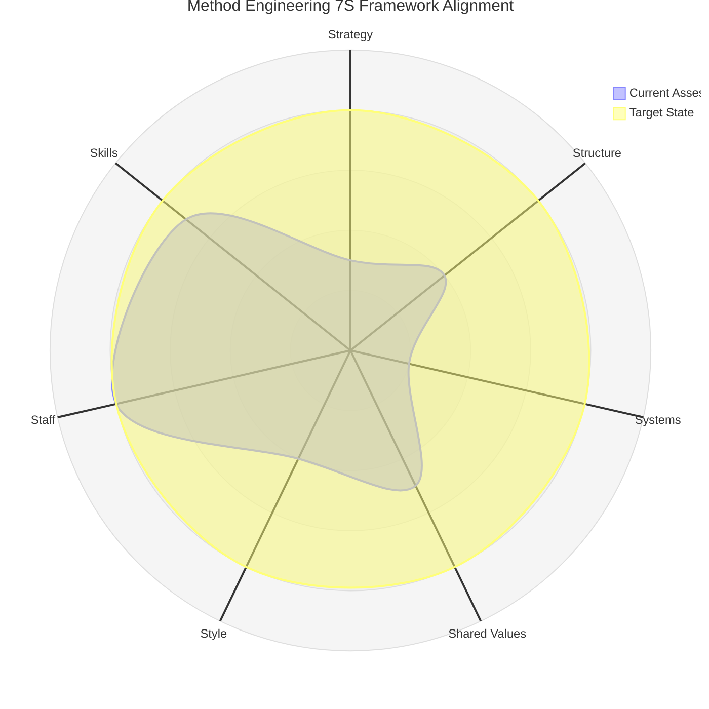

# Method Engineering 7S Framework Radar Chart

## Mermaid Radar Chart (Working Implementation)

## Current Assessment Summary

| Framework Element | Current Score | Target Score | Gap Analysis                                  |
| ----------------- | ------------- | ------------ | --------------------------------------------- |
| **Strategy**      | 3/10          | 8/10         | Critical - Need unified technical direction   |
| **Structure**     | 4/10          | 8/10         | Important - Authority and role clarity needed |
| **Systems**       | 2/10          | 8/10         | Critical - Process fragmentation issues       |
| **Shared Values** | 5/10          | 8/10         | Moderate - Cultural alignment needed          |
| **Style**         | 4/10          | 8/10         | Important - Leadership approach refinement    |
| **Staff**         | 8/10          | 8/10         | Strength - Excellent talent foundation        |
| **Skills**        | 7/10          | 8/10         | Good - Minor enhancement opportunities        |

## Priority Action Items Based on 7S Analysis

### Immediate Focus (Scores 2-3)

1. **Systems Improvement**: Address process fragmentation and decision-making workflows
2. **Strategy Alignment**: Establish unified technical direction and north star

### Secondary Focus (Scores 4-5)

3. **Structure Optimization**: Clarify roles, responsibilities, and authority
4. **Style Development**: Refine collaborative leadership approach
5. **Shared Values**: Strengthen cultural alignment around learning vs. analysis

### Maintain Strengths (Scores 7-8)

6. **Staff Excellence**: Continue leveraging exceptional talent
7. **Skills Enhancement**: Build on strong technical foundation

## Assessment Notes

Based on your comprehensive organizational analysis, these scores reflect:

- **Staff (8/10)**: Your analysis shows "Highly skilled individual contributors across all teams"
- **Skills (7/10)**: "Strong technical skills" with room for process skills improvement
- **Shared Values (5/10)**: Cultural conflicts between "Quality vs. speed, innovation vs. stability"
- **Strategy (3/10)**: "Technical strategy inconsistent across teams"
- **Structure (4/10)**: "Unclear technical decision hierarchy"
- **Systems (2/10)**: "Multiple disconnected systems and processes"
- **Style (4/10)**: "Collaborative but indecisive on technical matters"

This visualization supports your key finding that Method has "exceptional individual technical competency" operating within "systemic patterns that inhibit sustainable value delivery."
