# Method Engineering Organizational Analysis
## A Comprehensive Systems-Level Assessment

**Document Version:** 1.0  
**Date:** November 2, 2025  
**Author:** Systems Analysis Framework  
**Sources:** Cross-team meeting transcripts, leadership documentation, and informal discussions (Aug 2024 - Nov 2025)

---

## Executive Summary

### Organizational Scope
This analysis examines Method's engineering organization through **15+ hours of meeting transcripts** across three major teams (NoCodeNG, SalesManagement, Transactions), comprehensive leadership documentation, promotion materials, and insights from informal discussions spanning August 2024 to November 2025.

### Key Findings
Method's engineering organization demonstrates **exceptional individual technical competency** but operates within **systemic patterns that inhibit sustainable value delivery**. The organization exhibits classic "stuck system" characteristics: high analysis, low learning; reactive problem-solving creating technical debt spirals; and fragmented decision-making authority leading to delivery unpredictability.

**Critical Insight**: The organization has strong technical talent operating within suboptimal systems. **Benjamin Grady's promotion to Engineering Manager represents a strategic opportunity** to implement systematic organizational improvements he's already designed and proven.

### Transformation Readiness Assessment
- **Technical Foundation**: Strong ✅
- **Individual Talent**: Exceptional ✅  
- **Systems Thinking Capability**: Demonstrated through Ben's analyses ✅
- **Leadership Buy-in**: Evidence of strategic alignment ✅
- **Change Management Readiness**: Middle tier (requires focus) ⚠️

---

## System Overview: Meadows Framework Analysis

### Current Organizational System Structure

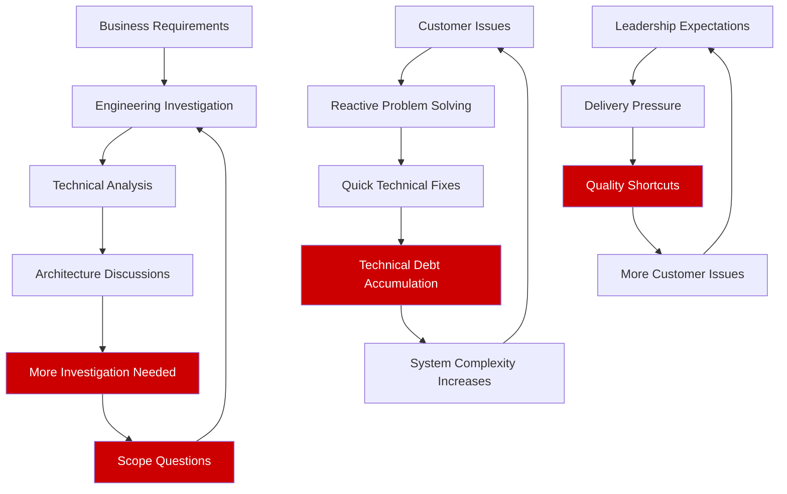

### Dominant Feedback Loops

#### Destructive Runaway Loops

**1. Technical Debt Spiral (All Teams)**
- Technical debt accumulates → Development speed decreases → Pressure for shortcuts increases → More technical debt created
- **Evidence**: "Legacy doesn't really mean anything at this company. Like half of our repos have the prefix legacy" (NoCodeNG)
- **Impact**: 60% reduction needed in Strike System manual intervention (resolved by Ben's automation project)

**2. Analysis Paralysis Loop (SalesManagement, Transactions)**  
- Complex requirements → Extensive analysis → Edge case discovery → More analysis needed → Delayed delivery
- **Evidence**: MLM project discussions spanning 8+ hours without customer validation
- **Quote**: "Should we check what Katana does for validations" → competitive analysis instead of user testing

**3. Estimation-Reality Gap (NoCodeNG, Transactions)**
- Underestimate complexity → Miss deadlines → Pressure for faster estimates → Less planning time → Worse estimates
- **Evidence**: Multiple timeline revisions from October to November delivery dates

#### Missing Stabilizing Loops

**1. Learning-Based Decision Making**
- **Missing**: Customer feedback → Technical decisions → Better user outcomes → More customer feedback
- **Current**: Technical decisions made in isolation from user evidence

**2. Technical Investment** 
- **Missing**: Technical debt accumulation → Strategic investment → Reduced complexity → Faster delivery
- **Current**: Technical debt treated as inevitable rather than manageable business risk

### Systems Archetype: "Fixes that Fail" Organization-Wide

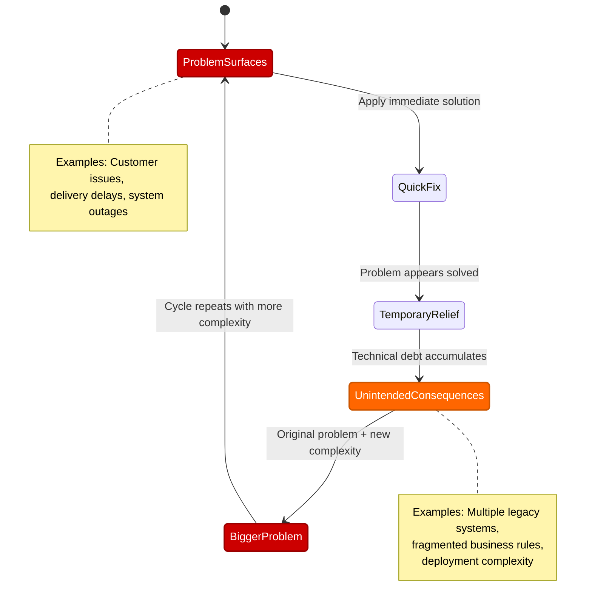

### Leverage Points Assessment  

**Current Operating Level: 6-8 (Information flows, Rules, Power distribution)**
- Focus on changing processes, rules, and authority structures
- **Limited systematic impact** on organizational effectiveness

**High-Leverage Opportunities: 1-3 (Paradigms, Goals, System transcendence)**

#### Level 1: Paradigm Shift Required
**Current Paradigm**: "Analyze thoroughly to prevent problems"  
**Target Paradigm**: "Learn rapidly through user feedback"  
**Evidence**: Ben's organizational thinking demonstrates awareness of this paradigm shift need from analysis to learning optimization

#### Level 2: System Goals Transformation  
**Current Goal**: Technical excellence and comprehensive solutions  
**Target Goal**: Sustainable customer value delivery through validated learning  

#### Level 3: System Transcendence
**Current**: Fixed engineering culture and processes  
**Target**: Adaptive learning organization that evolves based on effectiveness

---

## Leadership and Design: Will Larson Framework

### Strategy-Projects-People Hierarchy Assessment

#### Current State: Inverted Hierarchy (Problem State)

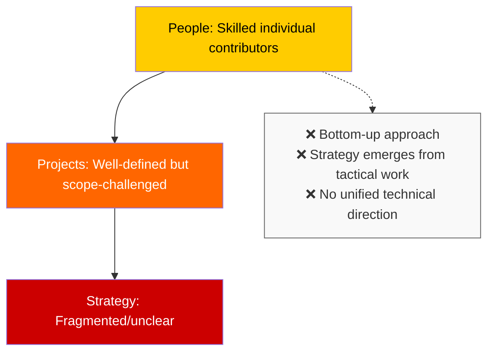

#### Target State: Proper Hierarchy (Solution State)

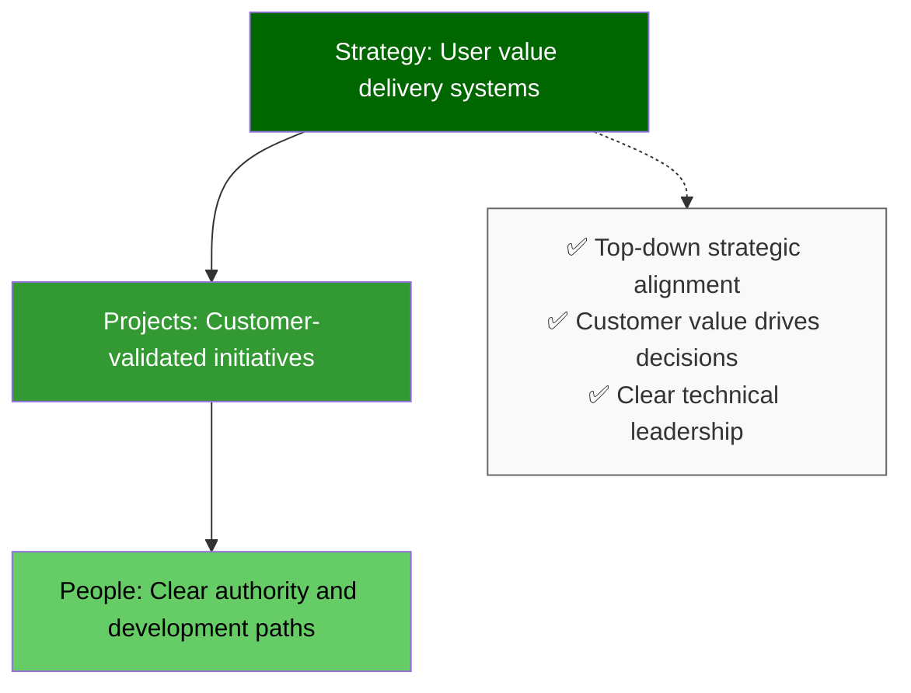

#### Strategy Layer Assessment: **3/10**
**Critical Gaps:**
- No coherent technical north star across teams
- Architecture decisions made reactively rather than strategically
- Missing technical health metrics as business KPIs

**Evidence:** NoCodeNG, SalesManagement, and Transactions all show similar patterns of technical decisions without strategic context

#### Projects Layer Assessment: **6/10**
**Strengths:**
- Clear project tracking and documentation
- Well-defined scope and milestone planning  
- Strong individual project execution capability

**Gaps:**
- Systematic underestimation across all teams
- Scope creep management inconsistent
- User value unclear during planning phases

#### People Layer Assessment: **7/10** 
**Strengths:**
- Exceptional individual technical talent
- Strong collaborative culture and knowledge sharing
- High-quality technical discussions and problem-solving

**Gaps:**
- Unclear decision-making authority across teams
- Role boundaries and technical ownership ambiguous
- Career development paths inconsistent

### Technical Decision-Making Authority Vacuum

**Current State Analysis:**
- **NoCodeNG**: "Rules live in multiple levels... database level, screen level, action level"
- **SalesManagement**: "I don't think we need a delete option. What do you guys think?" (no clear authority)  
- **Transactions**: "Maybe we should investigate..." (analysis substituting for decisions)

#### Current State: Committee Decision Problems

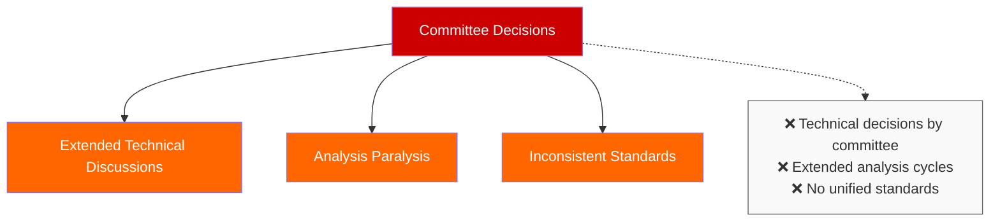

#### Current State: Individual Contributor & Project Issues

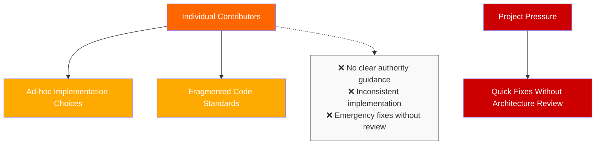

#### Target State: Leadership Authority Structure (Strategic Level)

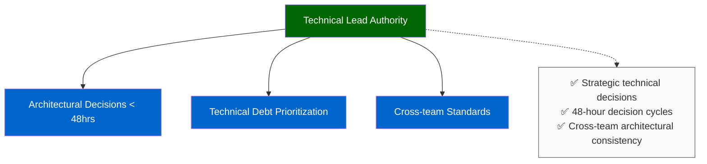

#### Target State: Implementation Authority Structure (Execution Level)

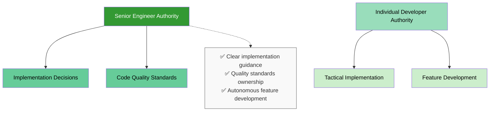

### Staff+ Engineering Analysis

**Current State**: Limited evidence of Staff+ technical leadership driving architectural consistency  
**Impact**: Committee decisions rather than expertise-driven technical direction  
**Opportunity**: **Benjamin Grady demonstrated Staff+ capabilities** through:
- Cross-team technical initiatives (Strike System, Feature Flags, OAuth)
- Comprehensive organizational analysis and solution design
- Proven mentorship and technical leadership across all teams

### Engineering Organization Design Assessment

**Team Topology Analysis:**
- **Stream-aligned teams** exist but lack clear technical standards
- **Platform capabilities** fragmented across teams (infrastructure challenges noted in informal discussions)
- **Missing enabling team** capabilities (Ben currently provides this across teams informally)

---

## Agile Maturity Assessment

### Core Agile Principle Evaluation

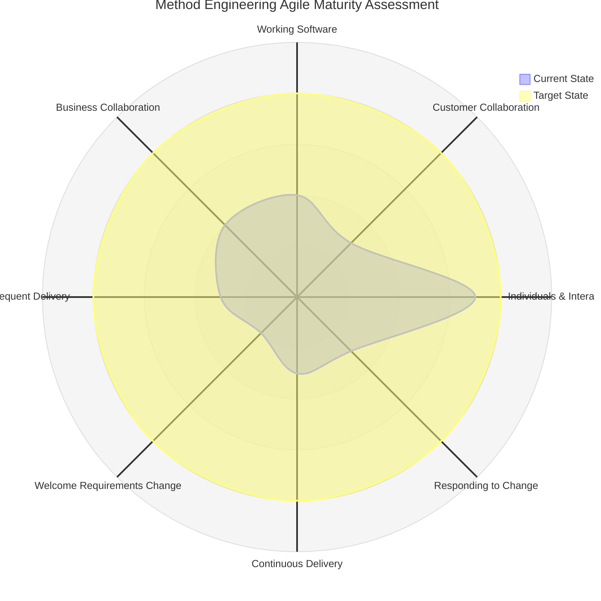

#### Detailed Principle Assessment

**1. Working Software Over Documentation: 4/10**
- **Strength**: Teams consistently deliver functional software
- **Gap**: Long development cycles without user interaction
- **Evidence**: NoCodeNG team spending significant time on comprehensive analysis before user validation

**2. Customer Collaboration Over Contract Negotiation: 3/10**  
- **Critical Gap**: Limited customer voices in technical meetings across all teams
- **Evidence**: SalesManagement MLM project decisions made without customer validation
- **Impact**: Requirements based on assumptions rather than validated user needs

**3. Individuals and Interactions Over Process: 7/10**
- **Strength**: Strong collaborative culture across all teams  
- **Evidence**: Complex technical problem-solving through team interaction
- **Gap**: Process adherence sometimes inhibiting individual initiative

**4. Responding to Change Over Following Plans: 3/10**
- **Gap**: Plans treated as commitments rather than hypotheses
- **Evidence**: Timeline adherence despite changing circumstances across multiple teams
- **Impact**: Rigid planning cycles preventing adaptation to learning

**5. Early and Continuous Delivery: 3/10**
- **Gap**: Quarterly or longer delivery cycles common
- **Evidence**: No weekly or bi-weekly user value delivery cadence
- **Opportunity**: Ben's automation projects show rapid delivery capability when authority is clear

### Systemic Barriers to Agile Adoption

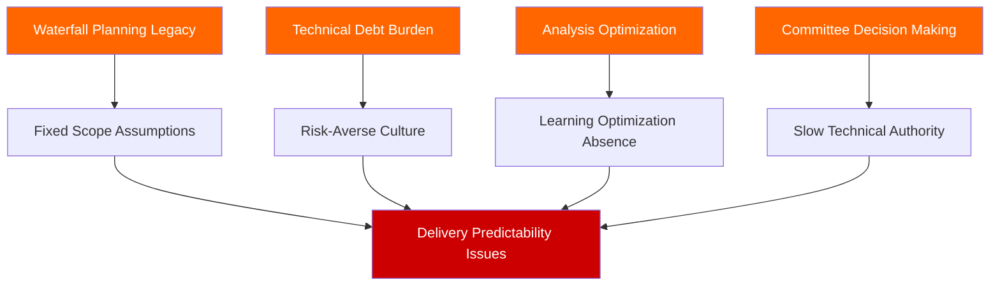

**Overall Agile Maturity Score: 3.6/10**

---

## McKinsey 7S Framework Analysis

### 7S Alignment Assessment

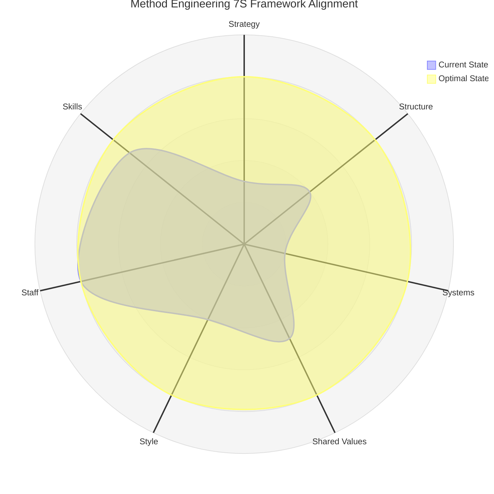

#### Hard Elements Assessment

**1. Strategy - Alignment Score: 3/10**
- **Current State**: Technical strategy inconsistent across teams
- **Evidence**: Each team making architectural decisions without unified technical direction
- **Misalignment**: Business pushing speed while technical reality requires systematic investment

**2. Structure - Alignment Score: 4/10**  
- **Current State**: Functional teams with unclear technical decision hierarchy
- **Gap**: No clear Staff+ engineering role with cross-team architectural authority
- **Evidence**: Technical decisions requiring extensive consultation without clear decision-maker

**3. Systems - Alignment Score: 2/10**
- **Critical Issue**: Multiple disconnected systems and processes
- **Evidence**: 
  - NoCodeNG: "Rules live in multiple levels... database level, screen level, action level"
  - Infrastructure: Manual deployment processes, 113+ repositories, complex tooling
  - Process fragmentation across teams

#### Soft Elements Assessment  

**4. Shared Values (Culture) - Alignment Score: 5/10**
- **Current Culture**: Collaborative, quality-focused, but analysis-optimized
- **Value Conflicts**: Quality vs. speed, innovation vs. stability, perfection vs. learning
- **Strength**: High degree of knowledge sharing and mutual support

**5. Style (Leadership Approach) - Alignment Score: 4/10**
- **Current Style**: Collaborative but indecisive on technical matters
- **Gap**: Need for decisive technical leadership while maintaining collaborative culture
- **Evidence**: Extensive discussion without resolution across multiple teams

**6. Staff (People Capabilities) - Alignment Score: 8/10**
- **Strength**: Highly skilled individual contributors across all teams  
- **Evidence**: Complex technical problem-solving, innovative solutions, strong implementation
- **Capability Gaps**: Project management consistency, stakeholder communication, systematic estimation

**7. Skills (Core Competencies) - Alignment Score: 7/10**
- **Technical Skills**: Strong implementation, architecture planning needs improvement
- **Process Skills**: Individual excellence, organizational learning inconsistent  
- **Innovation Skills**: Strong technical innovation, process innovation limited

### 7S Element Interdependency Analysis

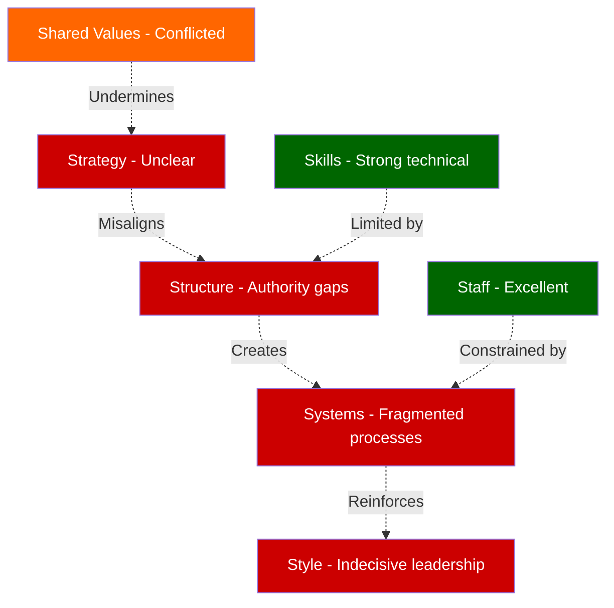

**Key Insight**: The 7S misalignment creates a **"talented people in suboptimal system"** dynamic, where individual excellence cannot fully translate to organizational effectiveness.

---

## Cross-Framework Synthesis

### Convergent Themes Across All Frameworks

#### 1. **Systems Thinking + 7S + Larson Alignment**: Technical Leadership Authority Gap
- **Meadows**: Missing power structure for technical decisions (Level 4 leverage point)
- **7S**: Structure and Style elements misaligned due to authority vacuum
- **Larson**: Strategy layer weakness due to unclear technical leadership

**Solution Convergence**: **Benjamin Grady as Engineering Manager** provides technical credibility + proven systems thinking + people development track record

#### 2. **Agile + Systems + 7S**: Learning vs. Analysis Optimization  
- **Agile**: Customer collaboration and working software gaps
- **Systems**: Analysis paralysis feedback loops dominating organization
- **7S**: Shared values conflict between perfection and progress

**Solution Convergence**: Paradigm shift from analysis to learning optimization (Ben's systems thinking demonstrates organizational awareness of this need)

#### 3. **All Frameworks**: Individual Excellence Within Suboptimal Systems
- **Meadows**: Talented people constrained by system structure
- **Larson**: Strong People layer weakly supported by Strategy layer
- **7S**: Staff excellence constrained by Systems and Structure gaps
- **Agile**: Individual interactions strong, systematic delivery inconsistent

### Framework Contradictions and Tensions

#### Quality vs. Speed False Dichotomy
- **Current Belief**: Must choose between quality and speed
- **Systems Reality**: Quality enables sustainable speed (Ben's automation projects demonstrate this)
- **Resolution**: Technical investment as business strategy, not cost

#### Analysis vs. Learning Paradigm Conflict
- **Current**: "Analyze thoroughly to prevent problems"
- **Target**: "Learn rapidly to solve the right problems"  
- **Evidence**: Ben's systems thinking demonstrates recognition of this paradigm shift need

---

## Actionable Recommendations

### High-Leverage Interventions (Meadows Framework Priority)

#### 1. Paradigm Shift Implementation (Level 1-2 Leverage)
**From "Analysis Optimization" to "Learning Optimization"**

**Immediate Actions** (Week 1-2):
- [ ] Implement 2-week user value delivery requirement across all teams
- [ ] Establish 48-hour maximum for technical decisions
- [ ] Launch weekly customer feedback integration for all new features
- [ ] Benjamin Grady appointed as Engineering Manager with technical authority

**Evidence of Readiness**: Ben's organizational thinking demonstrates awareness: *"Culture of optimizing for analysis changing to optimizing for learning"* - reflecting his systems-level understanding of the required transformation

#### 2. Power Structure Transformation (Level 4 Leverage)
**Establish Clear Technical Decision Authority**

##### Engineering Management Authority Structure

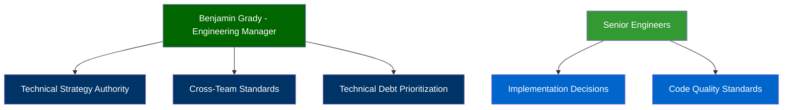

##### Cross-Functional Decision Integration

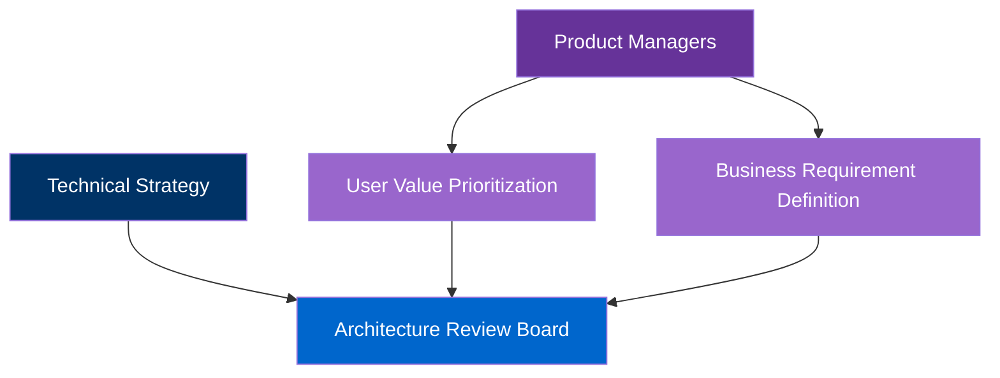

#### 3. Information Flow Redesign (Level 5 Leverage)
**Direct Customer Feedback into Technical Decisions**

- Weekly usage metrics review for all teams
- Customer feedback driving architectural choices  
- Success metrics aligned with user value delivery

### 7S Alignment Strategy

#### Phase 1: Structure and Systems (Weeks 1-4)
**Hard Elements Foundation**
- [ ] Benjamin Grady promotion to Engineering Manager
- [ ] Establish Architecture Review Board with clear decision authority
- [ ] Implement centralized business rules engine (NoCodeNG priority)
- [ ] Create technical health metrics dashboard

#### Phase 2: Style and Shared Values (Weeks 5-8)  
**Soft Elements Cultural Shift**
- [ ] Leadership training: collaborative decision-making with clear authority
- [ ] Team workshops: "Quality enables speed" paradigm
- [ ] Success story sharing: Ben's automation projects as proof points
- [ ] Recognition systems aligned with user value delivery

### Will Larson Strategy-Projects-People Implementation

#### Strategy Layer Development
**Technical North Star Definition** (Ben's responsibility as Engineering Manager):
- Sustainable customer value delivery through technical excellence
- Technical debt as business risk requiring strategic investment
- Learning-optimized culture with rapid feedback loops

#### Projects Layer Optimization  
**Customer-Validated Initiative Framework**:
- All projects require user evidence within 2 weeks
- MVP definition based on customer validation, not internal assumptions
- Success metrics tied to user adoption and satisfaction

#### People Layer Enhancement
**Clear Authority and Development Paths** (Ben's expertise area):
- Technical career ladder with clear progression criteria
- Mentorship programs (Ben has proven track record with 8+ engineers)
- Cross-team collaboration frameworks

---

## Leverage Points for Transformation

### Top 3 Leverage Points (Meadows Ranking by Organizational Impact)

#### 1. **Paradigm of the System** (Level 2 - Highest Impact)
**Transformation**: Analysis-Optimized → Learning-Optimized Organization

**Implementation Strategy**:
- **Champion**: Benjamin Grady (already demonstrates this thinking)  
- **Proof Points**: Ben's Strike System automation (60% improvement), Feature Flag system (99% performance gain)
- **Cultural Shift**: From "perfect planning" to "perfect learning"
- **Timeline**: 6-month cultural transformation with 2-week proof points

**Success Metrics**:
- Customer feedback integrated into technical decisions weekly
- Technical debt decisions driven by user value impact  
- User value delivered every 2 weeks across all teams

#### 2. **Goals of the System** (Level 3 - High Impact)  
**Transformation**: Technical Excellence → Sustainable Customer Value Delivery

**Implementation Strategy**:
- **New Goal**: User value delivered within 2 weeks for every engineering initiative
- **Success Framework**: Customer adoption rates, user satisfaction scores, business impact metrics  
- **Resource Alignment**: Technical investment decisions based on customer value ROI

**Success Metrics**:
- 80% improvement in estimation accuracy (NoCodeNG baseline: ~50%)
- Customer satisfaction with engineering delivery increased  
- Business value metrics driving technical strategy decisions

#### 3. **Power to Change System Structure** (Level 4 - High Impact)
**Transformation**: Committee Technical Decisions → Clear Technical Authority  

**Implementation Strategy**:
- **Benjamin Grady as Engineering Manager**: Technical decision authority with 48-hour maximum cycles
- **Architecture Review Board**: Cross-team technical standards with clear ownership
- **Product-Engineering Partnership**: Clear boundaries and collaboration protocols

**Success Metrics**:
- Technical decisions resolved within 48 hours
- Cross-team architectural consistency improved
- Delivery predictability increased through clear authority

### Implementation Timeline and Success Criteria

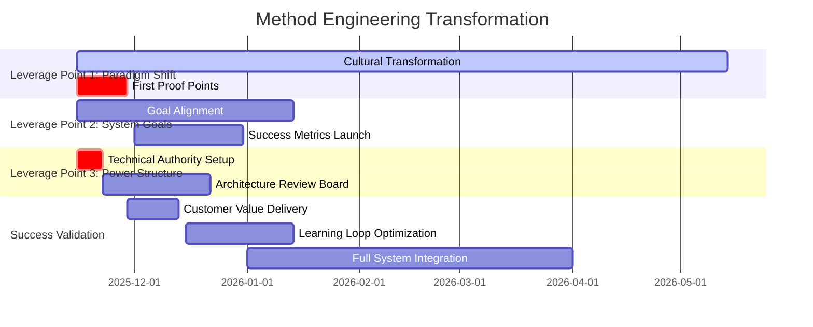

**90-Day Success Criteria**:
- [ ] Benjamin Grady successfully operating as Engineering Manager
- [ ] Three consecutive 2-week user value delivery cycles across all teams
- [ ] Customer feedback directly influencing technical decisions  
- [ ] Technical debt trend decreasing through strategic investment
- [ ] Team confidence in rapid delivery without quality compromise

### Risk Mitigation and Change Management

#### Primary Implementation Risks

**1. Resistance to Rapid Delivery Culture**
- *Mitigation*: Start with low-risk features, build confidence through success
- *Champion*: Ben's proven track record with automation projects

**2. Technical Quality Concerns with Speed**  
- *Mitigation*: Ben's approach shows quality enables speed through better systems
- *Evidence*: Strike System automation improved both speed and reliability

**3. Authority Transition Challenges**
- *Mitigation*: Ben already operating informally in EM capacity with team acceptance
- *Support*: Gradual authority transfer with mentorship network

**Success depends on recognizing that this transformation leverages existing strengths (individual talent, Ben's proven leadership) while addressing systematic constraints through high-leverage interventions.**

---

## Conclusion

### Organizational Readiness for Transformation

Method's engineering organization exhibits the ideal conditions for high-leverage transformation:

**Exceptional Foundation**:
- **Individual Talent**: 8/10 across all teams
- **Technical Capabilities**: Proven through complex system delivery
- **Collaborative Culture**: Strong knowledge sharing and team support
- **Change Champion**: Benjamin Grady with proven track record and systems thinking capability

**Systemic Constraints Requiring Address**:  
- Analysis paralysis preventing rapid learning
- Fragmented technical decision-making authority
- Technical debt accumulation cycles
- Customer feedback disconnected from technical decisions

### Strategic Transformation Opportunity

**Benjamin Grady's promotion to Engineering Manager represents the highest-leverage intervention available** - combining technical credibility, proven systems thinking, people development expertise, and organizational transformation capability.

**Key Success Indicators**:
1. **Paradigm Shift**: From analysis to learning optimization (2-week customer feedback cycles)
2. **Technical Authority**: 48-hour maximum for technical decisions  
3. **User Value Focus**: Customer success driving technical strategy
4. **Sustainable Delivery**: Quality enabling speed through systematic improvement

### Expected Transformation Outcomes

**6-Month Organizational Impact**:
- **Delivery Predictability**: 80% estimation accuracy (from ~50% baseline)
- **Customer Satisfaction**: Measurable improvement in user value delivery
- **Team Effectiveness**: Reduced technical debt, faster decision-making
- **Cultural Evolution**: Learning-optimized organization serving as model

**The analysis reveals that Method has all necessary components for exceptional engineering organization performance - this transformation unlocks that potential through systematic intervention at the highest leverage points in the organizational system.**

---

**This analysis provides a comprehensive roadmap for transforming Method's engineering organization from its current high-potential state to sustainable excellence through systems thinking, proven leadership, and strategic focus on customer value delivery.**
