# Breaking the Platform Bottleneck: Method's Path to Independent Product Teams

**MISSION: Transform Method from a shared service bottleneck into 8 autonomous teams that own platform capabilities and can ship customer value independently.**

## The Platform Crisis

**Method doesn't have a platform problem. Method doesn't have a platform.**

Right now, every product pod—Service Delivery, Transactions, Growth, Sales Management—needs custom changes from the No-Code team to ship anything meaningful. When every team depends on a single shared service to make progress, you don't have independent teams. You have a coordination nightmare disguised as product development.

**This cannot be solved with sprint planning. This requires rebuilding the foundation.**

### The Evidence: Platform Bottleneck Costs

Our comprehensive analysis across strategic, organizational, and technical dimensions reveals the same fundamental issue:

#### Strategic Cost: $825K Lost Revenue

- **[56% of paid users are dormant](#appendix-a-strategic-insights-summary)** because teams can't build persona-specific features without platform coordination
- **$825K annual revenue opportunity lost** to activation failures caused by development bottlenecks
- **[20.4pp adoption gap](#appendix-a-strategic-insights-summary)** between power users and teams because collaborative features require complex platform changes

#### Organizational Cost: 87.5% Delivery Failure

- **[87.5% failure rate](#appendix-b-organizational-analysis-summary)** when multiple teams need coordination to ship
- **[Committee-based technical decisions](#appendix-b-organizational-analysis-summary)** creating analysis paralysis instead of rapid iteration
- **["Fixes that Fail" organizational pattern](#appendix-b-organizational-analysis-summary)** where platform patches create more dependencies

#### Technical Cost: Monolithic Dependency Web

- **["Tightly coupled monolith masquerading as microservices"](#appendix-c-platform-systems-analysis-summary)** forces all teams through single runtime-core
- **[Template copying across 2,454 database instances](#appendix-c-platform-systems-analysis-summary)** makes every update a coordination event
- **4-8 day developer setup time** because the platform lacks proper ownership boundaries

### Why This Can't Be Sprint Planned Away

You cannot coordinate your way out of a knowledge centralization problem. When teams need platform changes, they're not just waiting for delivery capacity—they're **waiting for someone else to make decisions about their own domain**.

**The current reality:**

- Feature requests → Wait for No-Code team to understand requirements → No-Code team makes architectural decisions → Other teams implement without domain context → Suboptimal solutions
- Teams cannot build platform expertise → No-Code team becomes sole source of truth → Knowledge becomes more centralized
- No-Code team makes decisions for all domains → Cannot develop deep expertise in any specific domain → Decisions become generic rather than optimal

**This prevents teams from becoming experts in their own domains.**

## The Solution: Platform Ownership, Not Coordination

**Instead of centralizing platform knowledge in one team, we distribute platform ownership so teams can build deep expertise in their domains and make optimal decisions.**

### From Knowledge Centralization → Domain Expertise Distribution

**Current Knowledge Bottleneck Model:**

```
Stock App Updates    → No-Code Team holds all platform knowledge → Makes decisions for domain they don't specialize in → Suboptimal solutions
Customer Features    → No-Code Team holds all platform knowledge → Makes decisions for domain they don't specialize in → Suboptimal solutions
Professional Services → No-Code Team holds all platform knowledge → Makes decisions for domain they don't specialize in → Suboptimal solutions
```

**New Domain Ownership Model:**

```
Stock App Updates    → Action Automation Team builds deep workflow expertise → Optimal automation decisions
Customer Features    → Visualization Team builds deep data presentation expertise → Optimal UX decisions
Professional Services → AI Solutions Team builds deep AI/customization expertise → Optimal solution decisions
```

### The 8 Platform-Owning Teams

| Team                                                  | Domain Expertise & Platform Ownership           | Customer Value                 | Knowledge & Authority Gained                                  |
| ----------------------------------------------------- | ------------------------------------------------ | ------------------------------ | ------------------------------------------------------------- |
| **[Action Automation Team](#action-automation-team)** | Runtime-core, Action Engine, stock app workflows | _"Eliminate manual work"_      | Deep workflow & automation expertise, stock app decisions    |
| **[User Experience Team](#user-experience-team)**     | Screen Designer, UI components, navigation       | _"Work intuitively anywhere"_  | Deep interface & usability expertise, design decisions       |
| **[Integrations Team](#integrations-team)**           | External connectors, sync engines, APIs          | _"Connect business ecosystem"_ | Deep integration & API expertise, external system decisions  |
| **[Insights Team](#insights-team)**                   | Analytics, reporting, business intelligence      | _"Make decisions faster"_      | Deep analytics & data expertise, reporting decisions         |
| **[Visualization Team](#visualization-team)**         | Charts, dashboards, data presentation            | _"See business clearly"_       | Deep data visualization expertise, presentation decisions     |
| **[Auth Team](#auth-team)**                           | User management, permissions, security           | _"Secure complex structures"_  | Deep security & access expertise, permission decisions       |
| **[AI Solutions Team](#ai-solutions-team)**           | AI services, machine learning, automation        | _"AI-powered solutions"_       | Deep AI & customization expertise, solution architecture     |
| **[Internal Tools Team](#internal-tools-team)**       | Developer tools, deployment systems, CI/CD       | _"Enable rapid development"_   | Deep platform infrastructure expertise, deployment decisions |

### How This Breaks the Knowledge Bottleneck

**Example: Stock Apps need work order tracking**

**Before (Knowledge Centralization):**

1. Product team requests work order feature but doesn't understand platform constraints
2. No-Code team analyzes requirements using generic platform knowledge
3. No-Code team makes architectural decisions without deep workflow expertise
4. Implementation lacks domain-specific optimizations
5. Result: Generic work order tracking that doesn't leverage workflow best practices

**After (Domain Expertise):**

1. Action Automation Team has deep expertise in workflow patterns and automation
2. Team understands work order tracking as workflow automation problem
3. Team makes informed architectural decisions based on workflow optimization knowledge
4. Implementation leverages advanced automation patterns specific to work orders
5. Result: Optimized work order tracking with intelligent automation capabilities

**The key insight: Teams become domain experts who make optimal decisions, not implementers of generic platform solutions.**

### Breaking Knowledge Silos by Domain Ownership

**Current: All platform knowledge centralized in No-Code team**

- Stock app changes → No-Code team makes decisions without deep workflow expertise
- UI changes → No-Code team makes decisions without deep interface design expertise
- Workflow changes → No-Code team makes decisions without automation specialization
- Integration changes → No-Code team makes decisions without API optimization knowledge
- Analytics changes → No-Code team makes decisions without data visualization expertise

**New: Teams build deep domain expertise**

- Stock app changes → Action Automation Team applies specialized workflow & automation knowledge
- UI changes → User Experience Team applies specialized interface design & usability knowledge
- Integration changes → Integrations Team applies specialized API & external system knowledge
- Analytics changes → Insights Team applies specialized data analysis & intelligence knowledge

### Evidence This Solves The Problem

**Strategic Evidence: Activates 56% Dormant Users**

- Teams can build persona-specific features using deep domain expertise
- No knowledge bottlenecks blocking user activation features
- [Invoices feature](#appendix-a-strategic-insights-summary) showing 20.4pp adoption lift can be optimized and replicated across all domains

**Organizational Evidence: Enables Domain Expertise Development**

- Each team builds specialized knowledge within their domain
- No dependence on generalist No-Code team for domain-specific decisions
- Teams can make optimal technical decisions based on domain expertise rather than generic platform knowledge

**Technical Evidence: Breaks Monolithic Dependencies**

- [Template inheritance model](#appendix-c-platform-systems-analysis-summary) eliminates update conflicts
- Service ownership enables independent deployment
- Developer setup time reduced from 4-8 days to 1-2 days

### Expected Transformation Outcomes

- **From knowledge centralization → Domain expertise distribution**
- **From generic platform decisions → Specialized domain optimization**
- **From coordination dependencies → Autonomous domain authority**
- **From 6-8 week feature delivery → 1-2 week expert-driven delivery**

---

## Document Structure

### Core Analysis

- [**Platform Bottleneck Analysis**](#2-problem-statements) - Detailed evidence of current shared service dependency crisis
- [**Team Ownership Model**](#3-proposed-responsibility-based-team-structure) - How 8 teams eliminate platform coordination

### Implementation Details

- [**Platform Service Architecture**](#4-system-architecture-diagrams) - Technical mapping of team-to-service ownership
- [**Customer Personas**](#5-customer-personas) - Six SMB roles driving feature development
- [**Migration Strategy**](#6-migration-path-to-the-new-structure) - Four-phase transition from bottleneck to ownership

### Supporting Evidence

- [**Strategic Analysis**](#appendix-a-strategic-insights-summary) - 56% dormant users and $825K opportunity
- [**Organizational Analysis**](#appendix-b-organizational-analysis-summary) - 87.5% delivery failure patterns
- [**Platform Architecture Analysis**](#appendix-c-platform-systems-analysis-summary) - Monolithic dependency web

---

## 2. Platform Bottleneck Analysis

**The fundamental issue: Method has product teams that cannot ship features without coordinating through a shared platform service.**

### The Shared Service Death Spiral

**Current Reality: No-Code Team as Knowledge and Authority Bottleneck**

Every meaningful feature request follows the same pattern:

- Stock Apps need workflow updates → Must consult No-Code team for platform decisions and knowledge
- Customer Success needs onboarding improvements → Must get No-Code approval and technical direction
- Sales teams need pipeline automation → Depends on No-Code expertise and architectural decisions
- Professional Services needs custom features → Cannot build domain knowledge without No-Code guidance

**Result: One team holds all platform knowledge and decision authority, preventing other teams from developing expertise.**

### Quantified Impact of Platform Dependencies

**Strategic Cost: Lost Customer Activation**

- **[56% user dormancy rate](#appendix-a-strategic-insights-summary)** - teams cannot build persona-specific features fast enough
- **$825K annual revenue opportunity** blocked by inability to activate existing users
- **[20.4pp adoption gap](#appendix-a-strategic-insights-summary)** between individual and team usage because collaborative features require platform coordination

**Operational Cost: Coordination Failure**

- **[87.5% delivery failure rate](#appendix-b-organizational-analysis-summary)** when multiple teams need platform changes
- **[Committee-based technical decisions](#appendix-b-organizational-analysis-summary)** extending feature development cycles
- **6-8 week average delivery time** for features requiring platform modification

**Technical Cost: Architectural Complexity**

- **[Monolithic runtime-core](#appendix-c-platform-systems-analysis-summary)** where all changes risk breaking other teams
- **[Template copying across 2,454 database instances](#appendix-c-platform-systems-analysis-summary)** making updates coordination events
- **4-8 day developer setup** due to monolithic platform complexity

### Why Platform Dependencies Block Customer Success

**SMBs need persona-specific features but our platform bottleneck prevents building them.**

The connection between platform constraints and customer outcomes is direct:

**Example: Invoice Approval Workflows**

- **Business Need**: Finance Manager needs approval routing, Office Admin needs simple creation
- **Platform Reality**: Requires No-Code team to modify shared workflow engine
- **Coordination Cost**: 6-8 weeks of cross-team planning and testing
- **Customer Impact**: Generic invoicing experience, lower adoption

**Evidence: Features That Drive Team Adoption Cannot Be Built Fast Enough**

- **[Invoices feature shows 20.4pp adoption lift](#appendix-a-strategic-insights-summary)** - highest team driver identified
- **[539 partial accounts](#appendix-a-strategic-insights-summary)** representing $119K ARR opportunity need role-specific experiences
- **Platform bottleneck prevents replicating successful patterns** across other persona workflows

**The Platform-Customer Success Connection:**

- **Persona-specific features** require platform customization for each role
- **Platform customization** requires No-Code team coordination
- **Coordination delays** mean features ship months late or not at all
- **Generic experiences** fail to activate users, creating 56% dormancy

### The Platform Transformation Imperative

**The cost of maintaining the platform bottleneck exceeds the cost of breaking it apart.**

**Competitive Threat: AI Makes Platform Dependencies Obsolete**

- **AI democratizes software creation** - customers can build tools without us
- **Platform coordination delays** make Method slower than AI alternatives
- **Independent teams** can leverage AI while maintaining quality through ownership
- **Platform bottleneck** prevents us from competing in AI-enhanced development speed

**Market Opportunity: AI + Platform Ownership = Sustainable Advantage**

- **AI Solutions Team** can provide rapid prototyping with quality governance
- **Platform services** enable AI-generated features to integrate cleanly
- **Team ownership** allows rapid iteration on AI-enhanced capabilities
- **Quality control** differentiates us from pure AI code generators

**Strategic Transformation: From Coordination Bottleneck to Platform Ecosystem**

**2026 Vision: 8 Independent Platform Services**

- **Each team owns a platform capability** that others consume via APIs
- **Feature development** happens independently without cross-team coordination
- **Customer value delivery** accelerates from months to weeks
- **Platform evolution** happens through service improvement, not monolithic updates

**Success Metrics:**

- **From 6-8 week delivery → 1-2 week independent development**
- **From 56% user dormancy → Persona-specific activation**
- **From 87.5% coordination failure → Independent team success**
- **From $825K lost opportunity → Rapid feature iteration**

---

## 3. Detailed Problem Analysis

Method faces critical challenges that prevent us from delivering value effectively to both our internal teams and SMB customers. These issues fall into two main categories:

### Internal Team Friction

Our current organizational and technical structure creates significant barriers to efficient product development:

#### [Dependency Entanglement Between Teams](#dependency-entanglement-between-teams)

- Most stock apps depend heavily on a shared no-code platform (including runtime, schema, action sets, screen designer)
- This leads to coordination bottlenecks—teams can't confidently ship features without affecting or waiting on others
- Research shows that each additional inter-team dependency dramatically increases delays; having just three teams dependent on each other can reduce the chance of on-time delivery to 1 in 8¹

#### [Low Autonomy for App Teams](#low-autonomy-for-app-teams)

- App teams can't move independently because they're blocked by changes or limitations in platform infrastructure
- This reduces velocity and limits innovation at the edge of the platform
- Teams cannot make decisions unilaterally; any significant change requires approval or coordination with other teams
- This not only slows delivery but also stifles innovation – developers are less likely to experiment or propose bold improvements

#### [Update Fragility](#update-fragility)

- Customizations made by customer-facing teams create tension with automated app update processes
- Rollouts are fragile and can unintentionally break user-configured experiences
- [Platform architecture analysis](#appendix-c-platform-systems-analysis-summary) identifies this as "template-based deployment" creating conflicts when merging customer customizations with updates across 2,454 database instances
- Because the no-code platform is tightly coupled, even minor updates can require full platform regression testing
- Teams often queue changes into infrequent big releases, resulting in fewer, larger releases that carry more risk

#### [Lack of Clear Ownership Across Platform Components](#lack-of-clear-ownership-across-platform-components)

- **Technical decision authority vacuum**: [Analysis reveals](#appendix-b-organizational-analysis-summary) committee-based technical decisions creating extended analysis cycles
- **Monolithic runtime core**: [Platform analysis](#appendix-c-platform-systems-analysis-summary) identifies "tightly coupled monolith masquerading as microservices" creating coordination bottlenecks
- **Fragmented implementation standards**: Multiple teams making architectural choices without unified direction
- **Analysis paralysis**: [Organizational assessment shows](#appendix-b-organizational-analysis-summary) optimization for analysis over learning, creating delivery bottlenecks

**Systemic impact**: Our organizational analysis identifies this as a ["Fixes that Fail" pattern](#appendix-b-organizational-analysis-summary) where quick technical fixes create more complexity, requiring systematic intervention rather than process changes.

As Conway's Law predicts, a product's design reflects the organization's communication structure⁴ – our [organizational analysis](#appendix-b-organizational-analysis-summary) confirms this misalignment between current structure and desired architecture.

### Product Gaps for SMB Customers

Our current approach creates significant barriers to customer success and growth:

#### [Stock Apps Don't Engage Individual Users Within Customer Organizations](#stock-apps-dont-engage-individual-users-within-customer-organizations)

- **Underlying Problem**: The current stock apps are generalized and not tailored to the responsibilities of distinct roles (e.g. [Office Administrator](#persona-office-administrator), [Sales Lead](#persona-sales-lead-sales-manager), [Finance Manager](#persona-finance-manager-bookkeeperaccountant))
- **Impact**: Only one or two "power users" tend to adopt the product fully, while other users disengage or rely on external tools
- **Result**: Lower stickiness, lower expansion, and fewer advocates within each customer organization

For instance, an [Owner / General Manager](#persona-owner--general-manager) wants a quick snapshot of the business (sales trends, cash flow, staff performance) but instead sees generic CRM screens not tailored to their high-level overview needs. A [Sales Lead](#persona-sales-lead-sales-manager) cares about pipelines, lead follow-ups, and team performance metrics – yet the out-of-the-box design may not highlight these effectively, forcing them to manually pull data or use workarounds.

#### [Customer-Specific Customizations Are Difficult to Support Across Updates](#customer-specific-customizations-are-difficult-to-support-across-updates)

- **Underlying Problem**: SMBs frequently need workflows that diverge from stock templates, and these are delivered via Professional Services or customer self-configuration
- **Impact**: These customizations aren't always visible to product/platform teams, and often lack automated test coverage or safe update mechanisms
- **Result**: Updates risk breaking functionality, slowing down release cadence and damaging customer trust

This creates a vicious cycle where the fear of breaking customizations further slows our ability to innovate and improve the platform.

#### [Lack of Insight Into Real-World Usage and Friction Points](#lack-of-insight-into-real-world-usage-and-friction-points)

- **Underlying Problem**: The platform doesn't systematically capture feedback, feature usage, or pain points across personas or customer segments
- **Impact**: Teams miss opportunities to learn from real behavior, limiting their ability to improve workflows or prioritize the right enhancements
- **Result**: Product evolution is driven more by anecdote or high-touch feedback than representative data

Ultimately, **limited persona relevance is hampering Method's growth**. SMBs have very limited time and seek tools that immediately fit their workflow[³](#3-enterprise-sales-vs-smb-sales-a-side-by-side-comparison). If Method's platform requires significant tweaking or doesn't speak each role's language, busy users either disengage or seek alternate solutions. Method must evolve from a generic CRM to a **role-aware business platform**, where each type of SMB user finds direct, tailored value.

## 3. Proposed Responsibility-Based Team Structure

### Overview of the Team Model

We propose reorganizing our development organization into **8 cross-functional teams oriented around key strategic capabilities**, rather than around technical layers or broad product domains. Each team – roughly 6 to 8 people ("two-pizza team" size) – will own an **end-to-end slice of functionality** that delivers on specific business objectives. In practice, this means a team has all the skills needed (frontend, backend, QA, and ideally a product manager and designer) to **build, test, and deploy features** in their responsibility area with minimal hand-offs.

This structure addresses both **customer-facing capabilities** (insights, visualization, integrations) and **internal enablement** (internal tools, auth, AI solutions) while maintaining platform reliability (automation, user experience). Each team's mission is defined in terms of **strategic value delivery** to ensure alignment with Method's goals of serving SMB users more effectively while scaling our internal capabilities.

The guiding principle is that teams act as **mini start-ups** within their domain: they have the freedom to decide how to achieve their objectives (tools, approach) while being accountable for results. This approach draws inspiration from the Spotify model's emphasis on autonomy, communication, and quality⁵, while incorporating modern concepts of **stream-aligned teams** from Team Topologies⁹ ¹⁰.

## Team Overview: Customer Value & Capabilities

Each team has a clear customer value proposition and owns specific capabilities that directly serve SMB user needs:

| Team                                                  | Core Capabilities                                                                                                                     | 2026 Roadmap Items                                                                                                                                                     | Customer Value Delivered                                                                                                                    |
| ----------------------------------------------------- | ------------------------------------------------------------------------------------------------------------------------------------- | ---------------------------------------------------------------------------------------------------------------------------------------------------------------------- | ------------------------------------------------------------------------------------------------------------------------------------------- |
| **[Insights Team](#insights-team)**                   | • Business operational insights & intelligence<br/>• User workflow visualization<br/>• Forecasting tools<br/>• NPS + feedback loops   | • Coaching/suggestions for upselling<br/>• Isolate data points from reports<br/>• AI summarization of customer interactions<br/>• Enrichment of contact profiles       | _"Make data-driven decisions faster"_ - Transform raw business data into actionable intelligence                                            |
| **[Action Automation Team](#action-automation-team)** | • Runtime-core ownership & stock app workflows<br/>• Event-driven automations<br/>• Follow up systems<br/>• Global approutines        | • Stock app updates & no-code platform evolution<br/>• Event-driven automations (>daily frequency)<br/>• Sales scripts and playbooks<br/>• Platform-wide notifications | _"Eliminate manual work"_ - Own the no-code platform and automate all business processes                                                    |
| **[User Experience Team](#user-experience-team)**     | • Navigation & information architecture<br/>• Onboarding & user education<br/>• User research & testing<br/>• Feature discoverability | • Multi-channel communication (SMS, email, phone, chat)<br/>• Handling multiple segments (B2B, B2C) without customization                                              | _"Work intuitively anywhere"_ - Provide seamless, persona-specific interfaces                                                               |
| **[Internal Tools Team](#internal-tools-team)**       | • Robust dockerization<br/>• Isolated data resources & observability<br/>• Diagnostic tools empowered by knowledge documents          | • in-app QA<br/>• Live tracking<br/>• Easy integration with other tools                                                                                                | _"Enable rapid product development"_ - Build internal infrastructure that accelerates feature delivery                                      |
| **[Visualization Team](#visualization-team)**         | • Project management tools integrated with CRM<br/>• Easy checklists for processes<br/>• Live tracking displays                       | • Kanban boards & Gantt charts<br/>• Visual forecasting dashboards                                                                                                     | _"See business data clearly"_ - Transform complex data into intuitive visual insights                                                       |
| **[Integrations Team](#integrations-team)**           | • Data ingestion easier than paper<br/>• Easy integration with other tools<br/>• Email ingestion for customer insights                | • Social media lead generation<br/>• Multi-channel communication platforms<br/>• Ecommerce capabilities integration                                                    | _"Connect your entire business ecosystem"_ - Eliminate data silos by seamlessly connecting Method with all the tools SMBs already use       |
| **[Auth Team](#auth-team)**                           | • Handling multiple segments within same account<br/>• Role-based permissions<br/>• Multi-tenant security                             | • Advanced segment management<br/>• Cross-tenant data isolation                                                                                                        | _"Secure access for complex business structures"_ - Enable sophisticated permission management for franchises and multi-location businesses |
| **[AI Solutions Team](#ai-solutions-team)**           | • AI consultant that understands business problems<br/>• AI summarization of interactions<br/>• Intelligent tagging/categorization    | • AI-powered app generation with QA<br/>• Predictive analytics<br/>• Intelligent coaching systems                                                                      | _"AI-powered business solutions"_ - Deliver intelligent automation and insights that understand business context                            |

Below, we detail each team's mission, scope of ownership, and specific responsibilities.

## Teams and Responsibilities

### Insights Team

**Customer Value:** _"Make data-driven decisions faster"_ - Transform raw business data into actionable intelligence

**Mission:** Turn Method's data into persona-specific insights that drive SMB business decisions, from executive dashboards to predictive recommendations that help business owners act on opportunities before they miss them.

**Scope & Ownership:** End-to-end business intelligence pipeline serving both internal strategy and customer value. Owns data synthesis, forecasting models, and insight generation systems that directly impact SMB user success.

**Key Responsibilities:**

- **Business Operational Insights:** Executive dashboards, performance analytics, and trend analysis tailored to [SMB personas](#5-customer-personas)
- **Forecasting Tools:** Revenue predictions, demand forecasting, cash flow projections that enable proactive business planning
- **User Workflow Visualization:** Process optimization recommendations and bottleneck identification to improve operational efficiency
- **NPS + Feedback Loops:** Customer satisfaction tracking with improvement suggestions and retention insights
- **AI-Powered Coaching _(2026)_:** Intelligent suggestions for upselling opportunities and account growth strategies
- **Enriched Analytics _(2026)_:** Contact profile enhancement with predictive insights and AI summarization of customer interactions

### Action Automation Team

**Customer Value:** _"Eliminate manual work"_ - Own the no-code platform and automate all business processes to let SMB users focus on growth, not paperwork

**Mission:** Own the runtime-core and stock app catalog while making business automation accessible and reliable for SMB users. Turn repetitive manual tasks into intelligent workflows and deliver platform changes without coordination bottlenecks.

**Scope & Ownership:** Complete ownership of Method's runtime-core, Action Engine, and stock app workflows. This team eliminates the No-Code bottleneck by directly owning the platform that other teams used to wait for.

**Key Responsibilities:**

- **Runtime-Core Ownership:** Direct ownership of Method's core platform engine, eliminating coordination bottlenecks for stock app changes
- **Stock App Workflow Management:** Building and updating workflows across Method's entire app catalog without external dependencies
- **Event-Driven Automations:** Triggering automations based on business events with frequency beyond daily cycles (real-time to hourly execution)
- **Follow-Up Systems:** Automated sequences for sales, customer service, and operational workflows that never let opportunities slip through cracks
- **Global Approutines _(2026)_:** Universal automation templates that work across all Method apps and customer configurations
- **Sales Playbook Integration _(2026)_:** Built-in sales scripts and playbooks that trigger based on customer interactions and call platform events
- **Notification Hub _(2026)_:** Platform-wide notification system that consolidates alerts and ensures critical business events reach the right people

### User Experience Team

**Customer Value:** _"Work intuitively anywhere"_ - Provide seamless, persona-specific interfaces that adapt to how SMB users actually work

**Mission:** Create intuitive experiences that eliminate learning curves and enable SMB teams to work efficiently across devices and workflows, turning complex platform capabilities into simple, discoverable actions.

**Scope & Ownership:** The User Experience Team owns the overall user journey within Method, including navigation patterns, onboarding flows, help systems, and educational content. They ensure users can discover and effectively use platform features.

**Key Responsibilities:**

- **Navigation & Information Architecture:** Designing intuitive navigation patterns that help users efficiently move between features and find what they need
- **Onboarding & Education:** Creating guided tours, tutorials, and contextual help that educate users on platform capabilities
- **User Research & Testing:** Conducting user research to identify pain points and validate design decisions across different SMB personas
- **Accessibility & Usability:** Ensuring the platform is accessible and usable across different devices, abilities, and technical skill levels
- **Feature Discoverability:** Helping users discover and adopt new features through thoughtful UI/UX design and progressive disclosure

### Internal Tools Team

**Customer Value:** _"Enable rapid product development"_ - Build internal infrastructure that accelerates feature delivery and reduces operational overhead

**Mission:** Reduce internal bottlenecks that prevent us from delivering quickly by building tools and processes that accelerate development, support, and operations.

**Scope & Ownership:** The Internal Tools Team owns development tools, internal dashboards, support tools, and operational efficiency systems that enable other teams to work more effectively.

**Key Responsibilities:**

- **Developer Experience Tools:** Building CI/CD improvements, testing frameworks, deployment tools, and development environment optimizations
- **Support Tools:** Creating customer support dashboards, debugging tools, and automated issue resolution systems
- **Operational Dashboards:** Developing real-time monitoring, alerting, and business intelligence tools for internal operations
- **Process Automation:** Automating manual internal processes like customer onboarding, billing operations, and support ticket routing
- **Knowledge Management:** Building internal wikis, documentation systems, and knowledge sharing tools

### Visualization Team

**Customer Value:** _"See business data clearly"_ - Transform complex data into intuitive visual insights that drive immediate understanding and action

**Mission:** Provide customers with the ability to intuitively manipulate and understand their own data through sophisticated front-end components and visualization tools.

**Scope & Ownership:** The Visualization Team owns all customer-facing data visualization components, chart libraries, interactive dashboards, and data exploration tools that help SMB users understand their business data.

**Key Responsibilities:**

- **Interactive Chart Library:** Building and maintaining a comprehensive library of interactive charts, graphs, and data visualizations
- **Dashboard Builder:** Creating drag-and-drop dashboard building tools that allow customers to create custom views of their data
- **Data Exploration Tools:** Developing intuitive interfaces for customers to filter, sort, and drill down into their business data
- **Process Checklists _(2026)_:** Easy-to-configure checklists for operational processes (inspections, onboarding, quality control, signature collection)
- **Mobile-Optimized Visualizations:** Ensuring data visualizations work effectively on mobile devices for on-the-go business monitoring
- **Performance Optimization:** Optimizing visualization rendering for large datasets and ensuring smooth interactions

### Integrations Team

**Customer Value:** _"Connect your entire business ecosystem"_ - Eliminate data silos by seamlessly connecting Method with all the tools SMBs already use

**Mission:** Drive automation of external platforms that our customers use by building seamless, reliable connections between Method and third-party systems.

**Scope & Ownership:** The Integrations Team owns all external platform connections, API integrations, data synchronization, and third-party automation capabilities.

**Key Responsibilities:**

- **Platform Connectors:** Building and maintaining integrations with QuickBooks, Xero, email marketing tools, e-commerce platforms, and other business software
- **API Management:** Developing robust API authentication, rate limiting, error handling, and data transformation capabilities
- **Real-time Synchronization:** Ensuring data stays synchronized between Method and external systems with minimal latency
- **Integration Marketplace:** Building a marketplace or library of pre-built integrations that customers can easily enable
- **Custom Integration Tools:** Providing tools for power users or consultants to build custom integrations without deep technical knowledge

### Auth Team

**Customer Value:** _"Secure access for complex business structures"_ - Enable sophisticated permission management for franchises, multi-location businesses, and investor portfolios

**Mission:** Handle authentication and authorization within our platform, specifically supporting multi-tenant businesses like franchises and private equity portfolios.

**Scope & Ownership:** The Auth Team owns user identity management, permission systems, multi-tenant architecture, and access control across the entire platform.

**Key Responsibilities:**

- **Multi-Tenant Architecture:** Building robust tenant isolation and management systems for franchise and portfolio business models
- **Role-Based Access Control:** Developing granular permission systems that support complex organizational hierarchies
- **Single Sign-On (SSO):** Implementing enterprise SSO capabilities for larger customers with existing identity systems
- **Audit & Compliance:** Building audit trails and compliance reporting for businesses with regulatory requirements
- **Security Infrastructure:** Implementing security best practices, threat detection, and incident response capabilities

### AI Solutions Team

**Customer Value:** _"AI-powered business solutions"_ - Deliver intelligent automation and insights that understand business context and provide tailored recommendations

**Mission:** Transform how SMB users interact with business software by providing AI that understands business problems and delivers solutions without requiring technical expertise.

**Scope & Ownership:** Complete AI-powered business intelligence and solution generation, from conversational interfaces to predictive analytics and automated business recommendations.

**Key Responsibilities:**

- **AI Business Consultant:** AI agent that understands business problems and delivers contextual solutions tailored to SMB workflows and industry needs
- **Intelligent Interaction Summarization:** AI-powered analysis and categorization of customer communications with actionable insights
- **Conversational App Builder _(2026)_:** Natural language interface that generates validated no-code solutions with comprehensive QA frameworks
- **Predictive Business Analytics _(2026)_:** AI models that forecast business trends, identify opportunities, and suggest optimizations
- **Intelligent Process Coaching _(2026)_:** Context-aware suggestions for business improvements, upselling opportunities, and operational efficiencies
- **Confidence & Validation Systems:** Building mechanisms to assess the quality and appropriateness of AI-generated solutions before deployment
- **Human-AI Collaboration Tools:** Creating interfaces where Method consultants and customers can collaborate with AI to refine and perfect generated solutions

**Strategic Vision for AI Solutions:** This team positions Method at the forefront of the AI-powered software generation revolution. By combining AI's ability to understand and generate solutions with robust QA workflows, Method can offer the confidence and reliability that businesses need when adopting AI-generated software. The focus on validation and human oversight differentiates Method from pure AI code generation tools by ensuring business-grade quality and reliability.

## Engineering Coordination Architecture

**The coordination challenge: How do 8 autonomous domain-expert teams maintain technical coherence while optimizing for independent decision-making?**

Drawing from Will Larson's engineering leadership principles, we design coordination mechanisms that scale with domain complexity rather than fighting it. This isn't about process overhead—it's about creating systems that enable expertise to flow while maintaining architectural integrity.

### Staff+ Engineering Coordination Layer

**Current State: Staff+ Anti-Pattern**
Method currently has 2 Staff engineers without clear scope or accountability. They work on ad-hoc projects and get pulled into incidents, which creates several problems:
- No clear ownership or decision-making authority
- Other engineers unclear on when/how to engage Staff engineers
- Staff engineers become "floating resources" instead of force multipliers
- No measurable impact or accountability for Staff-level compensation

**Immediate Solution: Structured Staff Engineer Roles**

Rather than expecting current Staff engineers to operate at Principal level, we create structured roles that channel their skills effectively:

**Staff Engineer #1 - Platform Standards & Quality**
- **Clear Scope**: Code quality, testing standards, and technical debt management across all teams
- **Specific Responsibilities**:
  - Establish and maintain coding standards, testing patterns, and CI/CD practices
  - Review major technical decisions for quality and consistency (not architecture)
  - Lead technical debt reduction initiatives
  - Mentor Senior Engineers on best practices and code quality
- **Interaction Model**: Works WITH teams on their technical decisions, not making decisions FOR them
- **Accountability**: Code quality metrics, test coverage, technical debt reduction, developer satisfaction

**Staff Engineer #2 - Developer Experience & Tooling**
- **Clear Scope**: Internal developer productivity and platform tooling
- **Specific Responsibilities**:
  - Build and maintain internal development tools and scripts
  - Improve developer experience: faster builds, better debugging, easier local setup
  - Support teams with complex technical integration challenges
  - Own incident response coordination and post-mortem processes
- **Interaction Model**: Service provider to teams, not decision maker for teams
- **Accountability**: Developer velocity metrics, incident response time, tool adoption

**Future State: Grow Into Platform Architecture Role**
- After 12-18 months, evaluate if either Staff engineer has grown into cross-team architectural leadership
- If so, transition one to Principal Engineer role with true platform architecture scope
- If not, maintain current structure with clear domain focus

**Team Tech Leads (Senior Engineer Level)**
- Each team has a Senior Engineer as Tech Lead who interfaces with Principal Engineer
- Tech Leads handle ALL team-level technical decisions within their domain
- Clear escalation: Only cross-team architectural conflicts go to Principal Engineer
- Tech Leads NOT pulled into other teams' incidents or ad-hoc work

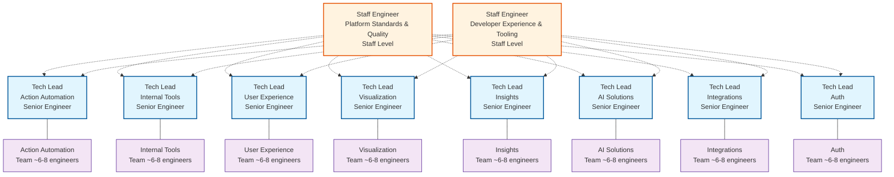
```mermaid
graph TD
    SQ[Staff Engineer<br/>Platform Standards & Quality<br/>Staff Level]
    ST[Staff Engineer<br/>Developer Experience & Tooling<br/>Staff Level]

    TL1[Tech Lead<br/>Action Automation<br/>Senior Engineer]
    TL2[Tech Lead<br/>Internal Tools<br/>Senior Engineer]
    TL3[Tech Lead<br/>User Experience<br/>Senior Engineer]
    TL4[Tech Lead<br/>Visualization<br/>Senior Engineer]
    TL5[Tech Lead<br/>Insights<br/>Senior Engineer]
    TL6[Tech Lead<br/>AI Solutions<br/>Senior Engineer]
    TL7[Tech Lead<br/>Integrations<br/>Senior Engineer]
    TL8[Tech Lead<br/>Auth<br/>Senior Engineer]

    AA[Action Automation<br/>Team ~6-8 engineers]
    IT[Internal Tools<br/>Team ~6-8 engineers]
    UX[User Experience<br/>Team ~6-8 engineers]
    VZ[Visualization<br/>Team ~6-8 engineers]
    IN[Insights<br/>Team ~6-8 engineers]
    AI[AI Solutions<br/>Team ~6-8 engineers]
    IG[Integrations<br/>Team ~6-8 engineers]
    AU[Auth<br/>Team ~6-8 engineers]

    %% Staff Engineers support all teams (dotted = advisory/supportive)
    SQ -.-> TL1
    SQ -.-> TL2
    SQ -.-> TL3
    SQ -.-> TL4
    SQ -.-> TL5
    SQ -.-> TL6
    SQ -.-> TL7
    SQ -.-> TL8

    ST -.-> TL1
    ST -.-> TL2
    ST -.-> TL3
    ST -.-> TL4
    ST -.-> TL5
    ST -.-> TL6
    ST -.-> TL7
    ST -.-> TL8

    %% Tech Leads own their teams (solid = ownership)
    TL1 --- AA
    TL2 --- IT
    TL3 --- UX
    TL4 --- VZ
    TL5 --- IN
    TL6 --- AI
    TL7 --- IG
    TL8 --- AU

    classDef staff fill:#fff3e0,stroke:#e65100,stroke-width:2px
    classDef techlead fill:#e1f5fe,stroke:#01579b,stroke-width:2px
    classDef team fill:#f3e5f5,stroke:#4a148c,stroke-width:1px

    class SQ,ST staff
    class TL1,TL2,TL3,TL4,TL5,TL6,TL7,TL8 techlead
    class AA,IT,UX,VZ,IN,AI,IG,AU team
```

### Platform Teams as Product Teams

Each platform team operates with **customer empathy for their internal customers**—other engineering teams. This fundamentally changes how coordination works.

**Customer Discovery for Platform Teams:**
- **Insights Team** customers: Teams needing analytics capabilities
- **Action Automation Team** customers: Teams needing workflow automation
- **User Experience Team** customers: Teams building user-facing features
- **Internal Tools Team** customers: All engineering teams needing development infrastructure

**Platform Team Customer Interface Design:**

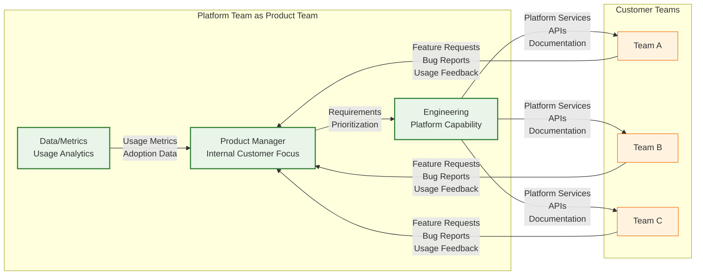
```mermaid
flowchart LR
    subgraph "Platform Team as Product Team"
        PM[Product Manager<br/>Internal Customer Focus]
        ENG[Engineering<br/>Platform Capability]
        DATA[Data/Metrics<br/>Usage Analytics]
    end

    subgraph "Customer Teams"
        C1[Team A]
        C2[Team B]
        C3[Team C]
    end

    C1 -->|Feature Requests<br/>Bug Reports<br/>Usage Feedback| PM
    C2 -->|Feature Requests<br/>Bug Reports<br/>Usage Feedback| PM
    C3 -->|Feature Requests<br/>Bug Reports<br/>Usage Feedback| PM

    PM -->|Requirements<br/>Prioritization| ENG
    DATA -->|Usage Metrics<br/>Adoption Data| PM
    ENG -->|Platform Services<br/>APIs<br/>Documentation| C1
    ENG -->|Platform Services<br/>APIs<br/>Documentation| C2
    ENG -->|Platform Services<br/>APIs<br/>Documentation| C3

    classDef platform fill:#e8f5e8,stroke:#2e7d32,stroke-width:2px
    classDef customer fill:#fff3e0,stroke:#ef6c00,stroke-width:1px

    class PM,ENG,DATA platform
    class C1,C2,C3 customer
```

### Interface Design Between Teams

**Technical Interface Standards (Inspired by Amazon's API Mandate):**

Every team must expose their capabilities through well-designed interfaces:

1. **Programmatic APIs**: All inter-team communication happens through APIs
2. **Documentation Standards**: OpenAPI specs, runbooks, SLA definitions
3. **Versioning Strategy**: Backward compatibility contracts and deprecation policies
4. **Observability**: Metrics, logging, and tracing for all inter-team interfaces

**Organizational Interface Standards:**

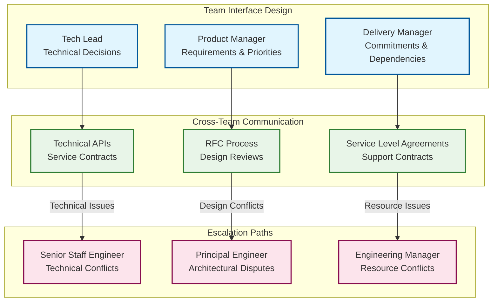
```mermaid
graph TD
    subgraph "Team Interface Design"
        TL[Tech Lead<br/>Technical Decisions]
        PM[Product Manager<br/>Requirements & Priorities]
        DM[Delivery Manager<br/>Commitments & Dependencies]
    end

    subgraph "Cross-Team Communication"
        API[Technical APIs<br/>Service Contracts]
        RFC[RFC Process<br/>Design Reviews]
        SLA[Service Level Agreements<br/>Support Contracts]
    end

    subgraph "Escalation Paths"
        SS[Senior Staff Engineer<br/>Technical Conflicts]
        PE[Principal Engineer<br/>Architectural Disputes]
        EM[Engineering Manager<br/>Resource Conflicts]
    end

    TL --> API
    PM --> RFC
    DM --> SLA

    API -->|Technical Issues| SS
    RFC -->|Design Conflicts| PE
    SLA -->|Resource Issues| EM

    classDef team fill:#e1f5fe,stroke:#01579b,stroke-width:2px
    classDef interface fill:#e8f5e8,stroke:#2e7d32,stroke-width:2px
    classDef escalation fill:#fce4ec,stroke:#880e4f,stroke-width:2px

    class TL,PM,DM team
    class API,RFC,SLA interface
    class SS,PE,EM escalation
```

### Engineering Flow Measurement

**Team-Level Metrics (inspired by DORA metrics):**
- **Lead Time**: Idea to production for team domain features
- **Deploy Frequency**: How often teams ship to production independently
- **Mean Time to Recovery**: How quickly teams resolve issues in their domain
- **Change Failure Rate**: Percentage of changes requiring hotfixes

**Platform Team Specific Metrics:**
- **Customer Adoption Rate**: Percentage of eligible teams using platform service
- **API Usage Growth**: Increasing consumption of platform capabilities
- **Customer Satisfaction**: Internal NPS from consuming teams
- **Time to Value**: How quickly consuming teams can integrate new platform features

**Cross-Team Interface Health:**

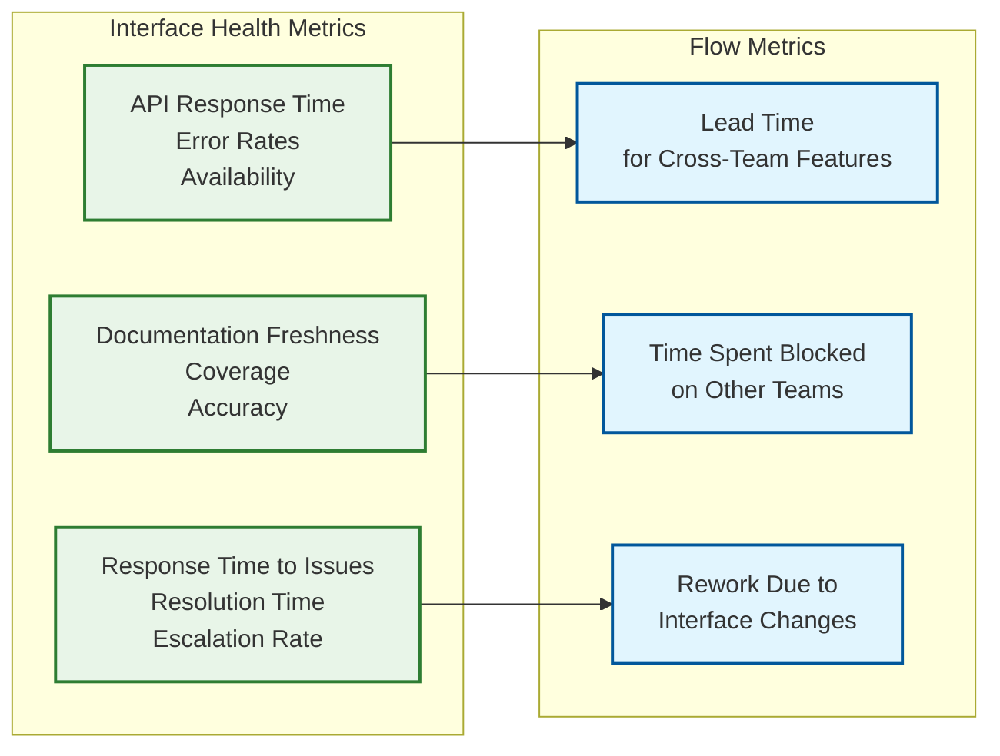
```mermaid
graph LR
    subgraph "Interface Health Metrics"
        API_HEALTH[API Response Time<br/>Error Rates<br/>Availability]
        DOC_HEALTH[Documentation Freshness<br/>Coverage<br/>Accuracy]
        SUPPORT_HEALTH[Response Time to Issues<br/>Resolution Time<br/>Escalation Rate]
    end

    subgraph "Flow Metrics"
        LEAD_TIME[Lead Time<br/>for Cross-Team Features]
        BLOCKED_TIME[Time Spent Blocked<br/>on Other Teams]
        REWORK_RATE[Rework Due to<br/>Interface Changes]
    end

    API_HEALTH --> LEAD_TIME
    DOC_HEALTH --> BLOCKED_TIME
    SUPPORT_HEALTH --> REWORK_RATE

    classDef health fill:#e8f5e8,stroke:#2e7d32,stroke-width:2px
    classDef flow fill:#e1f5fe,stroke:#01579b,stroke-width:2px

    class API_HEALTH,DOC_HEALTH,SUPPORT_HEALTH health
    class LEAD_TIME,BLOCKED_TIME,REWORK_RATE flow
```

### Technical Strategy Process

**Quarterly Architecture Strategy Process:**

1. **Team Strategy Proposals**: Each team proposes technical strategy for their domain
2. **Cross-Team Impact Analysis**: Senior Staff Engineers analyze interface implications
3. **Principal Engineer Review**: Platform-wide coherence and long-term implications
4. **Strategy Ratification**: Clear decision-making authority and communication

**RFC (Request for Comments) Process for Major Changes:**

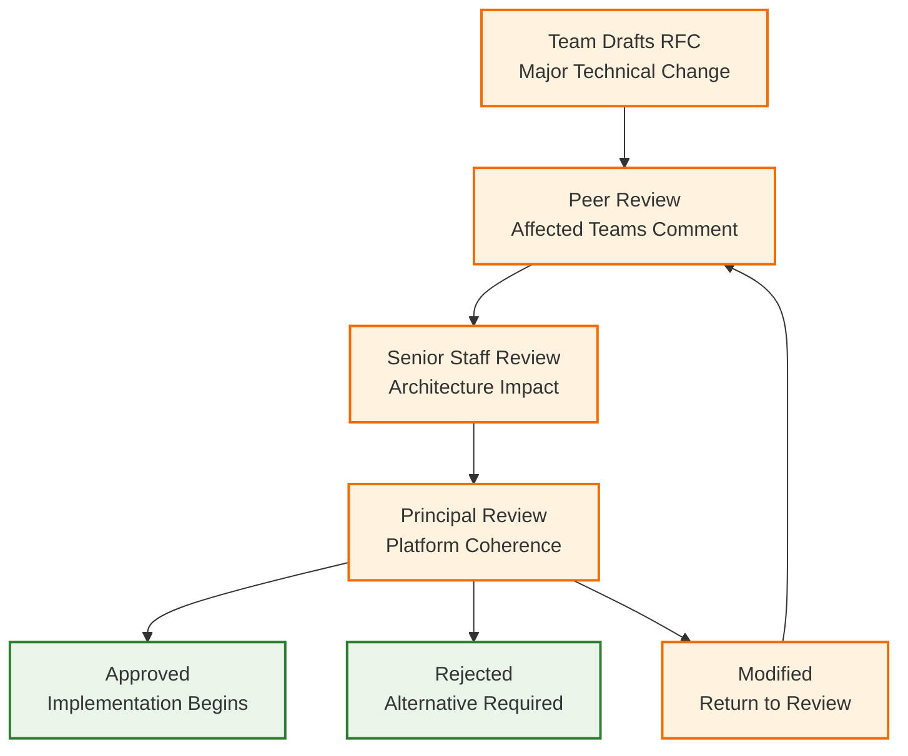
```mermaid
flowchart TD
    RFC_DRAFT[Team Drafts RFC<br/>Major Technical Change]
    PEER_REVIEW[Peer Review<br/>Affected Teams Comment]
    STAFF_REVIEW[Senior Staff Review<br/>Architecture Impact]
    PRINCIPAL_REVIEW[Principal Review<br/>Platform Coherence]

    APPROVED[Approved<br/>Implementation Begins]
    REJECTED[Rejected<br/>Alternative Required]
    MODIFIED[Modified<br/>Return to Review]

    RFC_DRAFT --> PEER_REVIEW
    PEER_REVIEW --> STAFF_REVIEW
    STAFF_REVIEW --> PRINCIPAL_REVIEW

    PRINCIPAL_REVIEW --> APPROVED
    PRINCIPAL_REVIEW --> REJECTED
    PRINCIPAL_REVIEW --> MODIFIED

    MODIFIED --> PEER_REVIEW

    classDef process fill:#fff3e0,stroke:#ef6c00,stroke-width:2px
    classDef outcome fill:#e8f5e8,stroke:#2e7d32,stroke-width:2px

    class RFC_DRAFT,PEER_REVIEW,STAFF_REVIEW,PRINCIPAL_REVIEW,MODIFIED process
    class APPROVED,REJECTED outcome
```

### Conflict Resolution and Escalation

**Clear escalation paths prevent coordination paralysis:**

- **Technical Disputes**: Senior Staff Engineer → Principal Engineer → CTO
- **Resource Conflicts**: Engineering Manager → Director of Engineering
- **Product Priority Conflicts**: Product Manager → Director of Product → CPO
- **Interface Design Disputes**: Principal Engineer (final technical authority)

The goal is **minimum viable coordination**—enough structure to maintain coherence, but not so much that domain expertise becomes diluted through committees.

## Platform Architecture Evolution: Conway's Law by Design

**How do we deliberately architect teams to produce the platform we need?**

Drawing from Will Larson's approach to systems thinking, these diagrams show the evolutionary path from knowledge-centralized monolith to domain-distributed platform architecture. Each diagram illustrates how team structure drives architectural outcomes.

### Current State: Knowledge Centralization Anti-Pattern

**The problem visualized—one team holds all platform decisions, creating architectural coupling:**

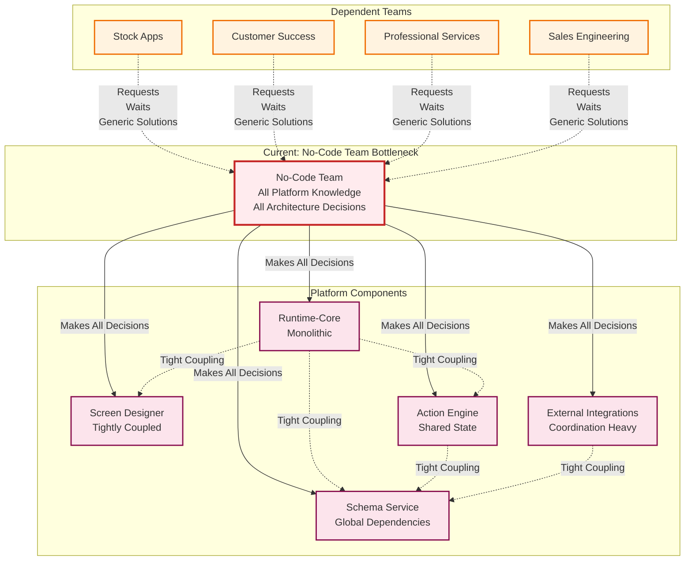
```mermaid
graph TB
    subgraph "Current: No-Code Team Bottleneck"
        NoCode[No-Code Team<br/>All Platform Knowledge<br/>All Architecture Decisions]
    end

    subgraph "Dependent Teams"
        StockApps[Stock Apps]
        CustomerSuccess[Customer Success]
        ProfServices[Professional Services]
        Sales[Sales Engineering]
    end

    subgraph "Platform Components"
        Runtime[Runtime-Core<br/>Monolithic]
        Designer[Screen Designer<br/>Tightly Coupled]
        Actions[Action Engine<br/>Shared State]
        Schema[Schema Service<br/>Global Dependencies]
        Integrations[External Integrations<br/>Coordination Heavy]
    end

    StockApps -.->|Requests<br/>Waits<br/>Generic Solutions| NoCode
    CustomerSuccess -.->|Requests<br/>Waits<br/>Generic Solutions| NoCode
    ProfServices -.->|Requests<br/>Waits<br/>Generic Solutions| NoCode
    Sales -.->|Requests<br/>Waits<br/>Generic Solutions| NoCode

    NoCode -->|Makes All Decisions| Runtime
    NoCode -->|Makes All Decisions| Designer
    NoCode -->|Makes All Decisions| Actions
    NoCode -->|Makes All Decisions| Schema
    NoCode -->|Makes All Decisions| Integrations

    Runtime -.->|Tight Coupling| Designer
    Runtime -.->|Tight Coupling| Actions
    Runtime -.->|Tight Coupling| Schema
    Actions -.->|Tight Coupling| Schema
    Integrations -.->|Tight Coupling| Schema

    classDef bottleneck fill:#ffebee,stroke:#c62828,stroke-width:3px
    classDef dependent fill:#fff3e0,stroke:#ef6c00,stroke-width:2px
    classDef coupled fill:#fce4ec,stroke:#880e4f,stroke-width:2px

    class NoCode bottleneck
    class StockApps,CustomerSuccess,ProfServices,Sales dependent
    class Runtime,Designer,Actions,Schema,Integrations coupled
```

### Target State: Domain Expertise Distribution

**The solution visualized—teams own domains and make optimal decisions:**


```mermaid
graph TB
    subgraph "Action Automation Team Domain"
        AATeam[Action Automation<br/>Team]
        Runtime[Runtime-Core<br/>Workflow Expertise]
        Actions[Action Engine<br/>Automation Patterns]
        StockApps[Stock App<br/>Workflows]
    end

    subgraph "User Experience Team Domain"
        UXTeam[User Experience<br/>Team]
        Designer[Screen Designer<br/>Interface Expertise]
        Components[UI Components<br/>Design System]
    end

    subgraph "Insights Team Domain"
        InsightsTeam[Insights<br/>Team]
        Analytics[Analytics Engine<br/>Data Expertise]
        Reports[Reporting Service<br/>Business Intelligence]
    end

    subgraph "Integrations Team Domain"
        IntegrationsTeam[Integrations<br/>Team]
        ExtSystems[External Systems<br/>API Expertise]
        SyncEngine[Sync Engine<br/>Data Flow]
    end

    subgraph "Visualization Team Domain"
        VizTeam[Visualization<br/>Team]
        Charts[Chart Library<br/>Data Presentation]
        Dashboards[Dashboard Builder<br/>Visual Design]
    end

    subgraph "Auth Team Domain"
        AuthTeam[Auth<br/>Team]
        Identity[Identity Service<br/>Security Expertise]
        Permissions[Permission Engine<br/>Access Control]
    end

    subgraph "AI Solutions Team Domain"
        AITeam[AI Solutions<br/>Team]
        AIService[AI Service<br/>ML Expertise]
        Generation[Code Generation<br/>QA Validation]
    end

    subgraph "Internal Tools Team Domain"
        InternalTeam[Internal Tools<br/>Team]
        DevTools[Developer Tools<br/>Platform Infrastructure]
        CICD[CI/CD Pipeline<br/>Deployment]
    end

    AATeam -->|Owns & Optimizes| Runtime
    AATeam -->|Owns & Optimizes| Actions
    AATeam -->|Owns & Optimizes| StockApps

    UXTeam -->|Owns & Optimizes| Designer
    UXTeam -->|Owns & Optimizes| Components

    InsightsTeam -->|Owns & Optimizes| Analytics
    InsightsTeam -->|Owns & Optimizes| Reports

    IntegrationsTeam -->|Owns & Optimizes| ExtSystems
    IntegrationsTeam -->|Owns & Optimizes| SyncEngine

    VizTeam -->|Owns & Optimizes| Charts
    VizTeam -->|Owns & Optimizes| Dashboards

    AuthTeam -->|Owns & Optimizes| Identity
    AuthTeam -->|Owns & Optimizes| Permissions

    AITeam -->|Owns & Optimizes| AIService
    AITeam -->|Owns & Optimizes| Generation

    InternalTeam -->|Owns & Optimizes| DevTools
    InternalTeam -->|Owns & Optimizes| CICD

    Runtime -->|Well-Defined API| Components
    Runtime -->|Well-Defined API| Analytics
    Actions -->|Well-Defined API| ExtSystems
    Identity -->|Well-Defined API| Runtime

    classDef team fill:#e8f5e8,stroke:#2e7d32,stroke-width:2px
    classDef service fill:#e1f5fe,stroke:#01579b,stroke-width:2px

    class AATeam,UXTeam,InsightsTeam,IntegrationsTeam,VizTeam,AuthTeam,AITeam,InternalTeam team
    class Runtime,Actions,StockApps,Designer,Components,Analytics,Reports,ExtSystems,SyncEngine,Charts,Dashboards,Identity,Permissions,AIService,Generation,DevTools,CICD service
```

### Interface Design Between Platform Services

**How teams communicate through well-designed interfaces:**

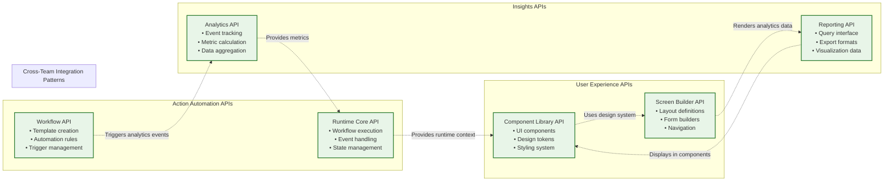
```mermaid
graph LR
    subgraph "Action Automation APIs"
        RuntimeAPI[Runtime Core API<br/>• Workflow execution<br/>• Event handling<br/>• State management]
        WorkflowAPI[Workflow API<br/>• Template creation<br/>• Automation rules<br/>• Trigger management]
    end

    subgraph "User Experience APIs"
        ComponentAPI[Component Library API<br/>• UI components<br/>• Design tokens<br/>• Styling system]
        ScreenAPI[Screen Builder API<br/>• Layout definitions<br/>• Form builders<br/>• Navigation]
    end

    subgraph "Insights APIs"
        AnalyticsAPI[Analytics API<br/>• Event tracking<br/>• Metric calculation<br/>• Data aggregation]
        ReportAPI[Reporting API<br/>• Query interface<br/>• Export formats<br/>• Visualization data]
    end

    subgraph "Cross-Team Integration Patterns"
        RuntimeAPI -.->|Provides runtime context| ComponentAPI
        WorkflowAPI -.->|Triggers analytics events| AnalyticsAPI
        ScreenAPI -.->|Renders analytics data| ReportAPI
        ComponentAPI -.->|Uses design system| ScreenAPI
        AnalyticsAPI -.->|Provides metrics| RuntimeAPI
        ReportAPI -.->|Displays in components| ComponentAPI
    end

    classDef api fill:#e8f5e8,stroke:#2e7d32,stroke-width:2px

    class RuntimeAPI,WorkflowAPI,ComponentAPI,ScreenAPI,AnalyticsAPI,ReportAPI api
```

### Information Flow and Feedback Loops

**How data and decisions flow through the platform:**

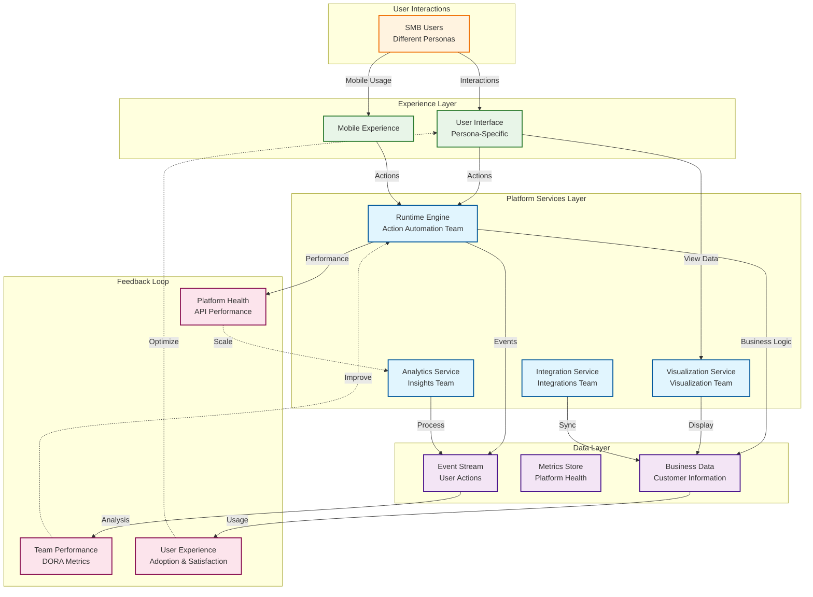
```mermaid
flowchart TD
    subgraph "User Interactions"
        Users[SMB Users<br/>Different Personas]
    end

    subgraph "Experience Layer"
        UI[User Interface<br/>Persona-Specific]
        Mobile[Mobile Experience]
    end

    subgraph "Platform Services Layer"
        Runtime[Runtime Engine<br/>Action Automation Team]
        Analytics[Analytics Service<br/>Insights Team]
        Visualization[Visualization Service<br/>Visualization Team]
        Integration[Integration Service<br/>Integrations Team]
    end

    subgraph "Data Layer"
        Events[Event Stream<br/>User Actions]
        Metrics[Metrics Store<br/>Platform Health]
        BusinessData[Business Data<br/>Customer Information]
    end

    subgraph "Feedback Loop"
        TeamMetrics[Team Performance<br/>DORA Metrics]
        UserMetrics[User Experience<br/>Adoption & Satisfaction]
        PlatformMetrics[Platform Health<br/>API Performance]
    end

    Users -->|Interactions| UI
    Users -->|Mobile Usage| Mobile

    UI -->|Actions| Runtime
    UI -->|View Data| Visualization
    Mobile -->|Actions| Runtime

    Runtime -->|Events| Events
    Runtime -->|Business Logic| BusinessData
    Analytics -->|Process| Events
    Visualization -->|Display| BusinessData
    Integration -->|Sync| BusinessData

    Events -->|Analysis| TeamMetrics
    BusinessData -->|Usage| UserMetrics
    Runtime -->|Performance| PlatformMetrics

    TeamMetrics -.->|Improve| Runtime
    UserMetrics -.->|Optimize| UI
    PlatformMetrics -.->|Scale| Analytics

    classDef user fill:#fff3e0,stroke:#ef6c00,stroke-width:2px
    classDef experience fill:#e8f5e8,stroke:#2e7d32,stroke-width:2px
    classDef platform fill:#e1f5fe,stroke:#01579b,stroke-width:2px
    classDef data fill:#f3e5f5,stroke:#4a148c,stroke-width:2px
    classDef feedback fill:#fce4ec,stroke:#880e4f,stroke-width:2px

    class Users user
    class UI,Mobile experience
    class Runtime,Analytics,Visualization,Integration platform
    class Events,Metrics,BusinessData data
    class TeamMetrics,UserMetrics,PlatformMetrics feedback
```

### Conway's Law Implementation

**How team structure produces desired architecture:**

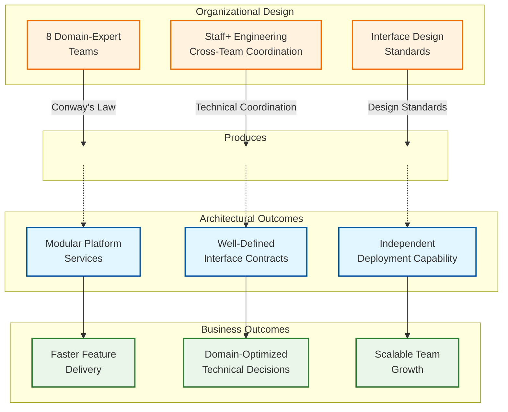
```mermaid
graph TB
    subgraph "Organizational Design"
        TeamStructure[8 Domain-Expert<br/>Teams]
        StaffPlus[Staff+ Engineering<br/>Cross-Team Coordination]
        Interfaces[Interface Design<br/>Standards]
    end

    subgraph "Produces"
        Arrow1[ ]
        Arrow2[ ]
        Arrow3[ ]
    end

    subgraph "Architectural Outcomes"
        ModularServices[Modular Platform<br/>Services]
        WellDefinedAPIs[Well-Defined<br/>Interface Contracts]
        IndependentDeployment[Independent<br/>Deployment Capability]
    end

    subgraph "Business Outcomes"
        FasterDelivery[Faster Feature<br/>Delivery]
        BetterDecisions[Domain-Optimized<br/>Technical Decisions]
        ScalableTeams[Scalable Team<br/>Growth]
    end

    TeamStructure -->|Conway's Law| Arrow1
    StaffPlus -->|Technical Coordination| Arrow2
    Interfaces -->|Design Standards| Arrow3

    Arrow1 -.-> ModularServices
    Arrow2 -.-> WellDefinedAPIs
    Arrow3 -.-> IndependentDeployment

    ModularServices --> FasterDelivery
    WellDefinedAPIs --> BetterDecisions
    IndependentDeployment --> ScalableTeams

    classDef org fill:#fff3e0,stroke:#ef6c00,stroke-width:2px
    classDef arch fill:#e1f5fe,stroke:#01579b,stroke-width:2px
    classDef business fill:#e8f5e8,stroke:#2e7d32,stroke-width:2px
    classDef invisible fill:transparent,stroke:transparent

    class TeamStructure,StaffPlus,Interfaces org
    class ModularServices,WellDefinedAPIs,IndependentDeployment arch
    class FasterDelivery,BetterDecisions,ScalableTeams business
    class Arrow1,Arrow2,Arrow3 invisible
```

### Migration Architecture Strategy

**The evolutionary path from current to target state:**

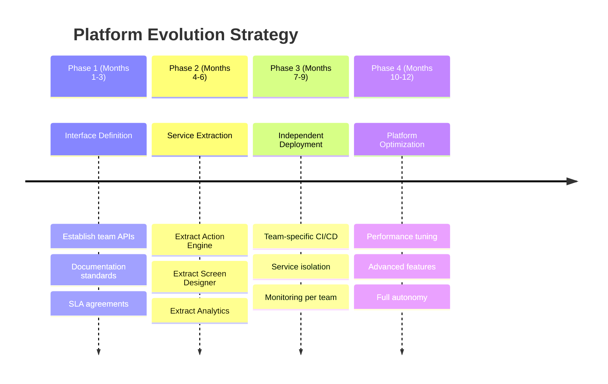
```mermaid
timeline
    title Platform Evolution Strategy

    section Phase 1 (Months 1-3)
        Interface Definition : Establish team APIs
                             : Documentation standards
                             : SLA agreements

    section Phase 2 (Months 4-6)
        Service Extraction : Extract Action Engine
                          : Extract Screen Designer
                          : Extract Analytics

    section Phase 3 (Months 7-9)
        Independent Deployment : Team-specific CI/CD
                               : Service isolation
                               : Monitoring per team

    section Phase 4 (Months 10-12)
        Platform Optimization : Performance tuning
                               : Advanced features
                               : Full autonomy
```

**The key insight: Architecture follows organization, so we design organization to produce the architecture we need.**

These diagrams show how deliberate team design produces platform architecture that enables domain expertise while maintaining system coherence. Each interface is designed for both technical and organizational clarity, enabling teams to make optimal decisions within their domain.

## 5. Customer Personas

A key part of tailoring the product experience is deeply understanding our **SMB user personas**. Below we define six common roles that Method serves in a comprehensive table format. These personas will guide how each team prioritizes features and designs solutions (for instance, the Insights team will think about what reports a Finance Manager needs, while the UX team ensures an Inventory Manager's screens are efficient for their tasks).

| Persona                                     | Role Description                                                                                                         | Goals                                                                                                                                                     | Pain Points                                                                                                                                 | Workflows                                                                                                              | Product Needs                                                                                                                                       | Team Dependencies                                                                                                                         |
| ------------------------------------------- | ------------------------------------------------------------------------------------------------------------------------ | --------------------------------------------------------------------------------------------------------------------------------------------------------- | ------------------------------------------------------------------------------------------------------------------------------------------- | ---------------------------------------------------------------------------------------------------------------------- | --------------------------------------------------------------------------------------------------------------------------------------------------- | ----------------------------------------------------------------------------------------------------------------------------------------- |
| **Owner / General Manager**                 | Primary decision-maker overseeing operations, finance, and strategy. Logs in weekly for oversight, not daily data entry. | • Monitor key metrics: sales, cash flow, satisfaction<br/>• Spot trends early for strategic decisions<br/>• Ensure team adoption and ROI                  | • Limited visibility across departments<br/>• Time-constrained, needs quick insights<br/>• Generic interfaces don't match executive needs   | • Weekly dashboard reviews and exception approvals<br/>• Quick context switching between business areas                | • Executive dashboard with mobile access<br/>• Configurable alerts and one-click drill-down<br/>• Team usage analytics                              | [Insights Team](#insights-team), [Action Automation Team](#action-automation-team), [User Experience Team](#user-experience-team)         |
| **Office Administrator**                    | Operational backbone managing daily tasks: appointments, invoices, onboarding, payroll. Heavy Method user.               | • Maintain accurate, current business records<br/>• Eliminate errors and automate routine work<br/>• Coordinate information across departments            | • Double entry between Method and QuickBooks<br/>• Information scattered across systems<br/>• Repetitive manual tasks and complex screens   | • Daily: Process leads, log communications, generate invoices<br/>• Ongoing: Update records, sync systems, run reports | • Seamless CRM-accounting integration<br/>• Automation templates and simplified forms<br/>• Powerful search and error prevention                    | [Integrations Team](#integrations-team), [Action Automation Team](#action-automation-team), [User Experience Team](#user-experience-team) |
| **Sales Lead (Sales Manager)**              | Revenue driver managing pipeline and team performance. Combines individual selling with team coaching.                   | • Hit targets and maintain healthy pipeline<br/>• Coach team with activity/performance visibility<br/>• Improve conversion rates and follow-up efficiency | • Manual reporting and scattered lead management<br/>• Poor data quality affecting forecasts<br/>• Limited context on customer interactions | • Daily: Review deals, update forecasts, reassign leads<br/>• Weekly: Team 1-on-1s and pipeline reviews                | • Visual drag-and-drop pipeline dashboard<br/>• Automated follow-up sequences<br/>• 360° customer view and mobile access                            | [Insights Team](#insights-team), [Action Automation Team](#action-automation-team), [User Experience Team](#user-experience-team)         |
| **Finance Manager (Bookkeeper/Accountant)** | Financial overseer managing invoices, bills, payroll, compliance. Often Office Admin wearing multiple hats.              | • Maintain accurate financial records<br/>• Eliminate duplicate CRM-accounting entry<br/>• Ensure compliance and audit integrity                          | • Manual reconciliation between systems<br/>• Data mismatches and security concerns<br/>• Limited reporting requiring Excel exports         | • Daily: Process sales for invoicing, manage receivables<br/>• Monthly: Generate combined financial reports            | • Seamless QuickBooks integration with controls<br/>• Financial dashboards and role-based permissions<br/>• Automated alerts and structured exports | [Integrations Team](#integrations-team), [Auth Team](#auth-team), [Insights Team](#insights-team)                                         |
| **Customer Support Representative**         | Customer issue resolver handling inquiries and tickets. Often Office Admin doubling as phone support.                    | • Resolve issues quickly and prevent escalations<br/>• Identify upsell opportunities<br/>• Maintain team knowledge sharing                                | • Fragmented customer data across systems<br/>• Informal tracking via spreadsheets/email<br/>• Repetitive responses without templates       | • Daily: Respond to cases, escalate issues, log interactions<br/>• Weekly: Review patterns, create templates           | • Unified customer view and ticket management<br/>• Knowledge base with canned responses<br/>• Automated follow-ups and escalations                 | [User Experience Team](#user-experience-team), [Action Automation Team](#action-automation-team), [Integrations Team](#integrations-team) |
| **Inventory/Operations Manager**            | Supply chain coordinator managing stock levels (product) or project delivery (service businesses).                       | • Maintain optimal inventory and avoid stockouts<br/>• Complete projects on schedule with proper resources<br/>• Coordinate sales-to-fulfillment handoffs | • Limited real-time status visibility<br/>• Manual updates and missing reorder alerts<br/>• Integration gaps causing double entry           | • Daily: Check levels, create orders, process fulfillment<br/>• Weekly: Reconciliation and status reviews              | • Complete inventory management with alerts<br/>• eCommerce/POS integration<br/>• Project tracking with calendar views                              | [Integrations Team](#integrations-team), [Action Automation Team](#action-automation-team), [Insights Team](#insights-team)               |

### Additional Product Requirements for Customer Support Representative

The Customer Support Representative persona requires specific product capabilities that extend beyond the standard CRM features:

- **Unified Customer View:** When a support rep opens a customer's record, they should see recent tickets/cases, recent purchases or interactions, and any notes from sales or finance that could be relevant. This prevents the rep from asking the customer redundant questions and gives context (e.g., "I see you just bought our product last month; sorry you're having an issue with it…").
- **Ticket Management Tools:** A way to log issues (cases) with statuses (New, In Progress, Resolved, etc.), priority, and assignment. Even if it's a simple app, it should support sorting and filtering so reps can manage their workload. Notifications when a ticket is assigned or updated would help keep everyone aligned.
- **Templates / Knowledge Base:** The ability to insert canned responses or have a repository of common solutions (could be as simple as text snippets or a linked wiki). If Method doesn't natively support a KB, maybe integration to an external one, but at least the rep should be able to quickly pull up FAQ answers.
- **Automation for Follow-ups:** If a case is in "Waiting on customer" status for 3 days, auto-send a reminder to the customer; or if a case is unresolved for too long, alert a manager. The Automation Team can implement these kind of support workflow automations to ensure nothing gets stuck.
- **Customer Self-Service Portal (Future):** Some CRMs allow customers to log in and view status or submit tickets. If Method has (or could have) a portal, support reps would benefit as it deflects simple queries. Even if not, at least an email acknowledgment to customers when they create a ticket would set expectations.
- **Integration with Communication Channels:** If possible, link Method with whatever channels customers come from – e.g., if a customer emails support@company.com, it auto-creates a case in Method. Or if they call, the rep can quickly create a case while on the phone. Reducing the data entry during a live call is important so they can focus on the conversation.

### Persona Analysis & Team Implementation

Each persona above has distinct needs, but there's overlap. For example, both the Owner and Finance Manager care about financial figures but in different granularity; both Sales Lead and Support Rep care about customer history but use it differently. By defining these personas, product development can identify where a feature for one persona might also help another (or how to tweak it). Our new responsibility-aligned teams will use these personas as a checklist to ensure coverage. We may even assign a persona champion within each team – someone who deeply thinks from, say, the Sales Lead's perspective, during design discussions. This user-centric approach, supported by the new team structure, will drive Method's 2026 goal of tailored experiences.

## 6. Migration Path to the New Structure

Transitioning from the current organization (and architecture) to this new responsibility-based model is a significant change. It must be handled incrementally and thoughtfully to mitigate risks. Here we outline a migration path covering team reorganization, technical refactoring, and risk mitigation:

### Phase 1: Preparation and Team Formation

- **Leadership Alignment & Vision Communication:** First, ensure all current team leads and stakeholders understand the why and what of this change. Present the new structure (perhaps using sections of this report) to get buy-in. Emphasize how this setup addresses current pain points (autonomy, faster delivery, quality for customers).

- **Define Clear Boundaries (Fracture Planes):** Analyze the existing codebase and application scope to outline bounded contexts or modules corresponding to the proposed teams. For example, identify all parts of the code related to "workflow actions," all parts related to "reports," etc. We may leverage fracture planes suggested by Team Topologies, such as business subdomains or even user personas¹⁰, to decide how to split the monolith. The target is that each new team can mostly work on one set of components with minimal overlap initially.

- **Reorganize Personnel into New Teams:** With ~50 developers, we might form about 5 main teams (as described). This could mean splitting existing larger teams or combining people from different current teams. For instance, if currently there's a "Backend team" and "Frontend team," we would peel off some backend and frontend devs into a cross-functional Data Ingestion Team, others into Automation Team, etc. We will assign interim tech leads for each new team, ideally those who have expertise in that area of the code. In parallel, assign product managers and UX designers to teams (even if shared across two teams initially due to headcount). We should also identify any gaps (maybe we need to hire or train someone for a specialized skill like data analytics for the Insights team).

- **Establish Team Charters:** Each new team should craft a one-page team charter (or Team API as earlier noted) detailing their mission, ownership scope, and initial backlog of responsibilities⁷ ¹⁷. This helps clarify boundaries. For example, the Automation Team's charter might state "owns workflow engine, automation rules UI; other teams can request new automation features through us." These charters can be shared org-wide to set expectations on who does what.

### Phase 2: Module Carve-Out and Dual Operating Mode

- **Architectural Modularization:** Begin refactoring the codebase to separate along the lines of team responsibilities. We don't aim for a full microservices split immediately, but perhaps create modular libraries or packages for each area. For example, isolate the action engine code into its own directory/repository that the main app calls via an interface. Similarly, segregate reporting logic. Use techniques like the "strangler pattern" to peel functionality without breaking everything – i.e., develop new services or modules alongside the old until fully ready. During this, set up clear API interfaces between modules (even if just function calls or internal HTTP APIs) to mirror how teams communicate. This code separation enforces the team boundaries technically.

- **Domain Leads and Guild Support:** During this carving out, allow a temporary Architecture Guild (senior devs/architects from each team) to guide the module boundaries and avoid breaking contracts. They'll ensure that, for instance, the Data team's changes to how QuickBooks sync works doesn't break something the Automation team expects, by aligning on interfaces. Essentially, we apply the idea of "if you built it, you run it" gradually: as soon as a module is decoupled enough, the respective team fully takes over running it in production.

- **Operate in Parallel (Old vs New Structure):** Recognize that we can't flip a switch; likely there will be a period where the legacy setup and new setup coexist. We might still have some old "functional teams" or legacy product owners keeping the lights on in existing system, while new teams start delivering improvements in their domain. For example, the Insights Team might start building a new dashboard module even as the old reporting mechanisms remain for a while. It's important to manage this dual mode: have clear decision-making so new teams can push forward without waiting on old processes. We may sunset legacy committees or reassign those roles to empower the new team leads.

- **Deliver Early Wins in New Model:** To build confidence, identify one or two pilot projects that the new teams can tackle relatively independently. For instance, let the Automation Team build a small new feature (like a "workflow template gallery") from start to finish. Or the Data Team could implement a new integration that was backlogged. Delivering it faster than before, and with quality, will showcase the benefit of the new structure and rally support.

### Phase 3: Gradual Transition of Ownership and Shutdown of Old Structures

- **Shift Ownership of Existing Features:** Start formally transferring ownership of parts of the existing product to the new teams. For example, assign all bug tickets related to the screen designer to the UX Team. Have the Platform Core Team take over all platform performance and security issues. This might require some knowledge transfer sessions from those who built those features originally (if they are now in a different team or left). Use documentation and hands-on shadowing to bring new team members up to speed. As ownership solidifies, update internal documentation: code repositories should list the owning team, and support tickets should be routed to the right team's queue.

- **Refactor Teams' Backlogs and Processes:** Each team should establish its own agile rituals (planning, stand-ups, retros) if not already. They should maintain a backlog focused on their responsibilities. It's likely initially their backlogs contain a mix of new initiatives (for personas) and legacy bugfix/tech debt tasks. Balance these to ensure stability while moving forward. Introduce a lightweight coordination process for cross-team work – e.g., if the Insights Team needs a change in the schema from Platform Team, how to request and track that. Possibly implement a "request ticket" system or just use the shared planning meetings to line these up.

- **Role-Based Access & Data Migration:** On the technical side, as we tailor experiences to roles, we should enhance the role-based access control (RBAC) in the platform. The Platform Core Team might introduce new user role definitions (Owner, Admin, Sales, etc. as first-class roles in Method if not already) and permissions structures so that new persona-specific features can be properly restricted or shown. During migration, careful attention is needed that existing customers' permissions don't change unexpectedly. Possibly run the new RBAC in parallel (audit mode) to see if any differences before enforcing. Also, if splitting databases or services, plan data migration scripts and tests. For example, if we move the "cases" data to a new support module or service, ensure all data is carried over. We might do phased migration: copy data to new module, run both for a bit to verify, then cut over writes to new module. The Platform Team will orchestrate these efforts, with each team testing their domain's data integrity.

- **Gradual Service Extraction & Releasing Independence:** Over time, as modules firm up, consider extracting them into independent deployables (if beneficial). E.g., the Action Engine could become a microservice. The aim is each team can deploy their part without deploying the whole system – achieving continuous delivery for each stream. Initially, even within a monolith, we can simulate this by feature flags (teams release features dark and toggle on when ready for all users). Eventually, break down the CI/CD pipeline per team. This reduces the "monolithic release" pain and allows more agility. Conway's Law will start to work for us here: the software structure aligns with the team structure, making each decoupled and faster⁴.

### Phase 4: Full Adoption and Optimization

- **Retire Old Team Habits:** Once the new teams are fully owning their domains, we can dissolve any residual old teams or roles. For example, if there was a "database admin team" separate before, their functions might now live in Platform Team – formally move those people or responsibilities over. Make sure performance review, hiring, etc., are all realigned to the new teams (people should have managers in their new team's chain). This cements the org change.

- **Monitor & Adjust Team Boundaries:** We should be open to adjusting the team scope if needed. Perhaps we discover the Insights Team has too broad a scope (if, say, they own both complex data warehousing and UI). We might split one team into two in the future (e.g., separate "Analytics Backend" vs "Reporting UI"). Or if two teams have a persistent heavy dependency, maybe their scopes need tweaking or they should merge. Use metrics like team delivery speed and dependency tracking to inform this. The goal is to have stream-aligned teams with minimal cognitive load per Team Topologies guidelines¹¹. Over time, create additional enabling teams if necessary (for example, a short-term Performance Task Force could be spun up from Platform team to solve a specific scaling issue, then retire).

- **Cultural Embedding:** Continue reinforcing the new culture – celebrate wins of teams acting autonomously, encourage innovation (hackathons within teams to address persona needs creatively), and use retrospectives at multi-team level to learn and improve coordination. Train everyone on writing and using the Team APIs and on the principle that "teams are products" with other teams as customers⁶. This mindset will help sustain the benefits.

### Risk Mitigation Considerations:

- **Knowledge Silos:** One risk is losing knowledge when reforming teams. Mitigate by having transitional pair programming or documentation from old domain experts. Possibly keep an "Architect Advisory" (could be existing senior devs) who float to guide teams on old system quirks initially.

- **Customer Impact:** We must avoid disrupting current users during migration. Use feature flags and beta releases for new components. For example, when rolling out the new dashboard by Insights Team, offer it as "Beta Dashboard" alongside the old one until fully vetted. Similarly, data migrations should be invisible to users or at least scheduled in maintenance windows.

- **Performance/Fragility During Transition:** Splitting services could have performance impacts (e.g., API call overhead). Counteract with thorough testing and perhaps temporarily running some things in parallel to compare. Platform Core Team should do load tests as modules extract. Keep a rollback plan for each major technical change.

- **Alignment Risk:** With autonomy can come divergence. Mitigate by the coordination practices discussed (guilds, shared planning). Also possibly define some guardrails – e.g., all teams must use common logging, common UX style guide, etc., to keep the product unified.

- **Employee Morale:** Change can be hard. Some may resist new roles or fear job security (especially if their current specialty is de-emphasized). Proactively address this with HR support, clarity that no one is losing jobs – instead, jobs are becoming more impactful. Provide training where needed (e.g., if a QA engineer now works embedded in a dev team, train the team on how to do integrated QA). Emphasize career growth: they'll get to broaden skills and see more direct impact on customers.

This migration path is a gradual evolution, not a sudden revolution. By incrementally carving out modules, aligning them to newly formed teams, and using both organizational and technical strategies to reduce risk, Method can transition to the 2026 target state with minimal disruption. We acknowledge it's a journey – possibly 6-12 months to fully transition – but each step will yield improvements (e.g., even in month 3 we might see faster delivery in one area). Throughout, we measure success in things like deployment frequency, cycle time for features, and customer satisfaction per persona (did support tickets drop after we gave Support Reps better tools? etc.). If something's not working, we adapt – the structure is not dogma, but a means to achieve our strategic goals.

## 7. Industry Best Practices & References

The proposed structure and process draw on several industry-proven principles in modern tech organizations:

- **Conway's Law & Architecture Alignment:** As mentioned, Conway's Law states that system design mirrors org communication structure⁴. Rather than fight this, we use it: by structuring teams around key product areas, the software will evolve into well-defined components for those areas¹⁶. Our approach is consistent with stories from companies who reorganized to align with their desired architecture, breaking monoliths into services owned by small teams. This reduces the "tensions" and communication overhead that arise when architecture and org chart diverge¹⁶. In practice, it means if we want a decoupled platform (which we do for faster deployment), we need decoupled teams first.

- **Team Topologies & Stream-Aligned Teams:** The structure essentially creates stream-aligned teams (focused on continuous flow of value in a particular domain) as described by Skelton and Pais (Team Topologies)⁹ ¹⁰. Each of our teams (Data, Insights, etc.) is aligned to a flow of work that directly matters to customers. We also introduce a Platform team which is a core concept in Team Topologies – a team dedicated to providing a stable internal platform that stream-aligned teams can use, thereby reducing their cognitive load. This separation of platform vs product teams helps balance innovation and standardization. Our enabling constructs like guilds and chapters echo Team Topologies' ideas for enabling and complicated subsystem teams as well – if a particular aspect gets too complex, we might spin up a specialist team temporarily. We've also adopted the Team API concept from Team Topologies⁷, encouraging teams to define how others interact with them – this formalizes inter-team communication and sets expectations (such as service level agreements for support requests, as exemplified in that literature¹⁸).

- **Spotify Model (Squads, Tribes, Guilds):** We have heavily leveraged the Spotify Engineering Culture model for our coordination strategy⁵. Our teams are essentially squads – autonomous, cross-functional units with a mission. We anticipate increased autonomy and innovation because, as Spotify's model showed, giving teams control and trusting them leads to more engagement and faster decision-making⁵. We are implementing guilds and chapters to maintain alignment without heavy bureaucracy¹² ¹³. It's worth noting that many organizations have tried variants of the Spotify model; key lessons are to adapt it rather than adopt blindly. We'll watch out for guilds becoming too talk-heavy and ensure they produce tangible standards or solutions. But overall, the ethos of "loosely coupled, tightly aligned" from Spotify is what we're after.

- **Amazon's "Two-Pizza Teams" & API-First Approach:** Amazon famously organized into small teams that own services and communicate via APIs. We're mirroring that by making teams small and ownership clear. Jeff Bezos' mandate of "you build it, you run it" and every team exposing service interfaces (even to internal teams) is akin to our Team API approach⁷. This reduces dependency bottlenecks and fosters a culture of accountability. We cited how platform teams can be run like product teams – that insight from HashiCorp's blog aligns with Amazon's internal platform mindset. Treating internal developers as customers of the platform team ensures the platform evolves in a way that serves engineering needs, which in turn leads to better product development. We'll encourage each team to think of their work as a service – e.g., the Data Team provides "data-as-a-service" to other teams, with defined expectations.

- **DevOps & Autonomy for Speed:** Our plan is also influenced by DevOps research (e.g., the Accelerate book's findings) which shows small batches, high deploy frequency, and team autonomy correlate with high performance. We specifically aim to break the monolithic release cycle into on-demand deployments by each team. One reference point: a case study where a company moved to independent services noted improved deployment frequency and stability. We foresee similar benefits – each team can deploy more often since they don't have to coordinate a global release, and issues will be localized (thus easier to fix and less likely to cascade). We've built in DevOps practices by having Platform Core ensure CI/CD and monitoring from the get-go in the new model.

- **Product Mindset and Customer-Centricity:** A subtle but important shift is running engineering with a product mindset. Not just the platform team as a product team⁶, but each team thinking of the personas they serve as their "product market". For example, the Automation Team's "customers" are users who want to automate tasks; they should seek feedback from those users, iterate on features, and even measure adoption of their features. This aligns with agile and lean principles – build, measure, learn – now applied at a team feature level. It breaks the old model where engineering just implemented requirements from product; instead, each team is partly a mini product team that can drive solutions for their domain. This is very much in line with modern agile organizations where even engineering teams talk to end-users and understand the problem, not just the requirements.

- **Engineering Org Design Examples:** Companies like Spotify, Amazon, Netflix, and HubSpot have all shared their approaches to scaling teams. A common theme is autonomy with alignment (as we've stressed). Another theme is focus on reducing cognitive load per team. By limiting each team's scope, we let them become experts rather than spread thin. HubSpot, for instance, organized teams by persona at one point (small business marketer vs sales rep personas) – a similar philosophy to ensure each team deeply empathizes with a user segment. We opted to organize by responsibilities (like features) rather than strictly by persona, because our analysis (and the Medium blog on fracture planes²) suggests that aligning by business capability (which multiple personas use) can achieve autonomy while still allowing focus on personas via cross-cutting concerns.

- **Continuous Improvement & Retrospectives:** Borrowing from agile, we will set up periodic retrospectives not just within teams but across the engineering org to reflect on the new structure. This echoes the Lean principle of continuous improvement (Kaizen). Many companies after reorgs do a 6-month check – we should do the same: measure key metrics (deployment frequency, lead time for changes, number of support escalations, etc.) and see if they've improved. If not, we tweak the structure or processes. The goal is not just to implement these best practices, but to create a learning organization that adapts them as we grow (the model that works at 50 devs might need tweaks at 70 devs, and that's okay).

### References

Throughout this report, we've cited sources that back up our approach:

- Skelton & Pais's Team Topologies concepts on team dependencies and APIs⁷ ⁹.
- Atlassian's summary of the Spotify model highlighting team autonomy and squad structure⁵.
- Agile Alliance insights on how dependencies impact delivery (each dependency halving on-time probability)¹, reinforcing why reducing inter-team dependencies is crucial.
- Medium articles on splitting monoliths with a team-first approach² that justify choosing organizational boundaries (fracture planes) that match natural business domains or user roles for easier decoupling.
- A Medium piece contrasting SMB and Enterprise sales cycles and decision-making[³](#3-enterprise-sales-vs-smb-sales-a-side-by-side-comparison), which we used to underline the importance of impressing the SMB owner (the key decision-maker).
- HashiCorp's recommendation to treat platform engineering with a product mindset⁶, guiding how our Platform Core Team should operate.

By aligning our transformation with these well-regarded practices and learnings from industry, we increase the likelihood of success. Method's leadership can be confident that this proposal isn't unproven theory – it's built on the shoulders of successful transformations at other companies, tailored to Method's unique context. In implementing it, we should remain flexible, keep listening to team feedback, and be ready to adjust while holding true to the core principles of autonomy, responsibility, and customer-focus. This structured yet adaptive approach will drive Method toward its 2026 goals and beyond, yielding an engineering organization that is scalable, innovative, and relentlessly focused on our SMB users.

---

## Appendices

### Appendix A: Strategic Insights Summary

_Based on comprehensive analysis of 1,227 active accounts, 3,785 users, 52 weeks of data, and 286 apps_

#### User Activity Distribution: The 56% Problem

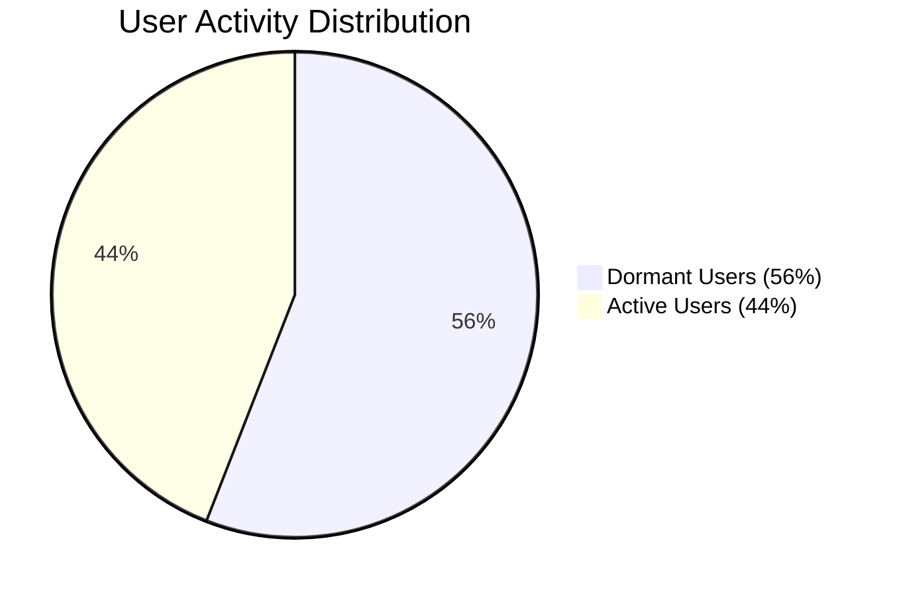
```mermaid
pie title User Activity Distribution
    "Dormant Users (56%)" : 4804
    "Active Users (44%)" : 3785
```

#### Feature Impact Analysis: Team Drivers vs Universal Features

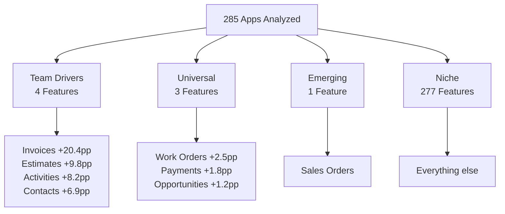
```mermaid
graph TD
    A[285 Apps Analyzed] --> B[Team Drivers<br/>4 Features]
    A --> C[Universal<br/>3 Features]
    A --> D[Emerging<br/>1 Feature]
    A --> E[Niche<br/>277 Features]

    B --> F[Invoices +20.4pp<br/>Estimates +9.8pp<br/>Activities +8.2pp<br/>Contacts +6.9pp]
    C --> G[Work Orders +2.5pp<br/>Payments +1.8pp<br/>Opportunities +1.2pp]
    D --> H[Sales Orders]
    E --> I[Everything else]
```

#### Account Distribution by Adoption Tier

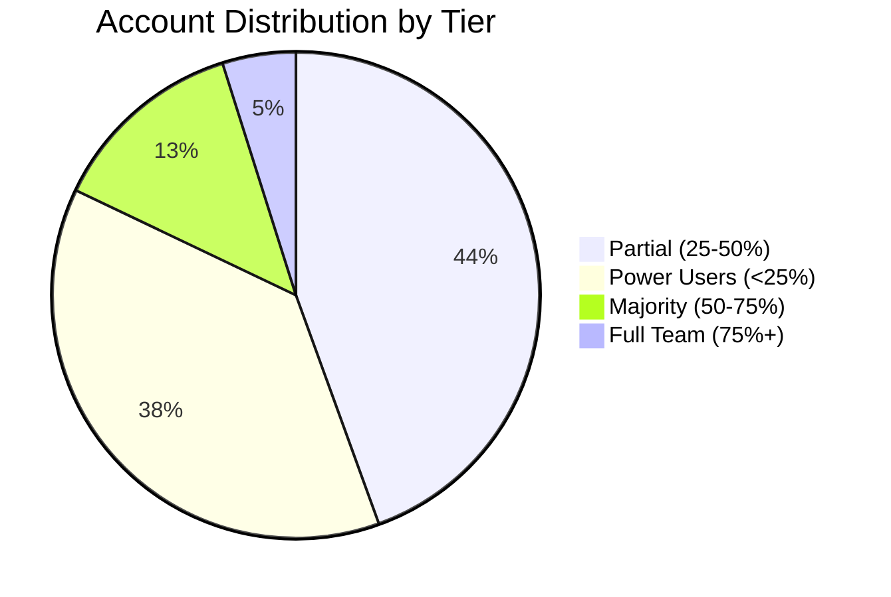
```mermaid
pie title Account Distribution by Tier
    "Partial (25-50%)" : 539
    "Power Users (<25%)" : 456
    "Majority (50-75%)" : 158
    "Full Team (75%+)" : 59
```

#### ROI Projection for Team Activation Strategy

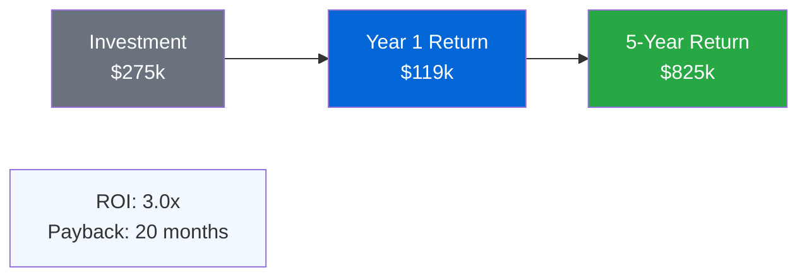
```mermaid
graph LR
    A[Investment<br/>$275k] --> B[Year 1 Return<br/>$119k]
    B --> C[5-Year Return<br/>$825k]

    D[ROI: 3.0x<br/>Payback: 20 months]

    style A fill:#6a737d,color:#fff
    style B fill:#0366d6,color:#fff
    style C fill:#28a745,color:#fff
    style D fill:#f1f8ff
```

#### Key Findings from 2026 Strategic Analysis

**The 56% Problem**: [Our analysis](/Users/bengrady/code/EMRoadmap/2026_STRATEGIC_INSIGHTS.md#executive-summary) reveals that 56% of paid users (4,785 individuals) never use the product, despite being in accounts that average 7.0 users each.

**Activation vs. Acquisition Opportunity**:

- **Current reality**: Sales lands 7 seats per account, but Product only activates 3 users
- **Revenue impact**: [539 partial accounts](#appendix-a-strategic-insights-summary) (44.5% of total) represent $119k ARR opportunity
- **Retention correlation**: [Full team accounts retain 15.2pp better](#appendix-a-strategic-insights-summary) than power user accounts at Week 26

**Feature Impact Analysis**:

- **[Invoices drives +20.4pp adoption lift](#appendix-a-strategic-insights-summary)** from Power Users to Full Team - 3x more than any other feature
- **Top 4 Team Drivers**: Invoices (+20.4pp), Estimates (+9.8pp), Activities (+8.2pp), Contacts (+6.9pp)
- **Investment recommendation**: Focus 80% of product resources on these team collaboration drivers

**Implementation Roadmap**:

- **Q1 2026 priorities**: [Invoices approval workflows](#appendix-a-strategic-insights-summary) (8 weeks, $50k), user activation analytics (4 weeks, $20k), dormant user campaign (4 weeks, $20k)
- **Success timeline**: Judge results at Week 26 (Q3 2026), not Week 1 - early metrics will look worse due to onboarding friction
- **ROI projection**: [$275k investment → $825k 5-year return](#appendix-a-strategic-insights-summary) (3.0x ROI, 20-month payback)

**Strategic Decision**: Choose ACTIVATION over acquisition - we have 4,785 dormant users representing massive untapped potential.

_Full analysis available: [2026_STRATEGIC_INSIGHTS.md](/Users/bengrady/code/EMRoadmap/2026_STRATEGIC_INSIGHTS.md)_

### Appendix B: Organizational Analysis Summary

_Based on comprehensive systems-level assessment using Meadows, Larson, McKinsey 7S, and Agile frameworks_

#### Current vs Target Organizational Hierarchy

**Current State: People-Strong, Strategy-Weak**

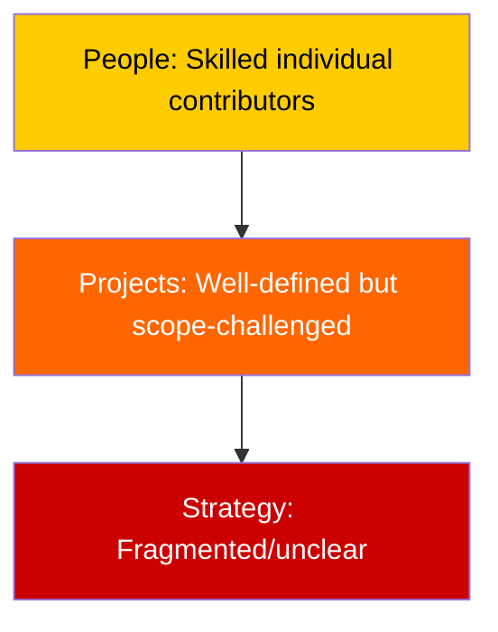
```mermaid
flowchart TD
    A[People: Skilled individual contributors] --> B[Projects: Well-defined but scope-challenged]
    B --> C[Strategy: Fragmented/unclear]

    style A fill:#ffcc00,color:#000000
    style B fill:#ff6600,color:#ffffff
    style C fill:#cc0000,color:#ffffff
```

**Target State: Strategy-Led, People-Empowered**

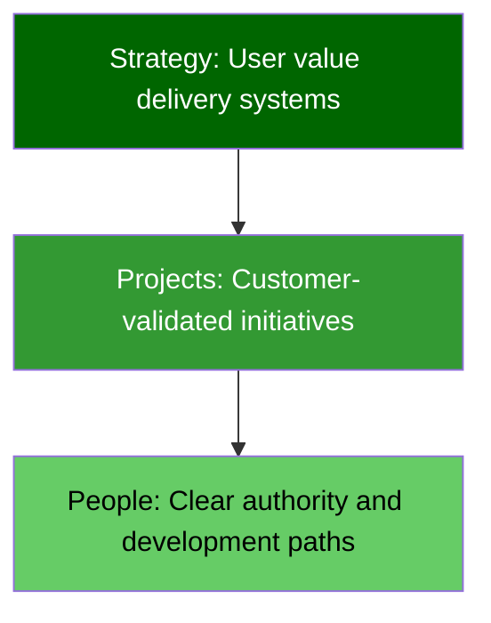
```mermaid
flowchart TD
    E[Strategy: User value delivery systems] --> F[Projects: Customer-validated initiatives]
    F --> G[People: Clear authority and development paths]

    style E fill:#006600,color:#ffffff
    style F fill:#339933,color:#ffffff
    style G fill:#66cc66,color:#000000
```

#### Systems Archetype: "Fixes that Fail" Organization-Wide

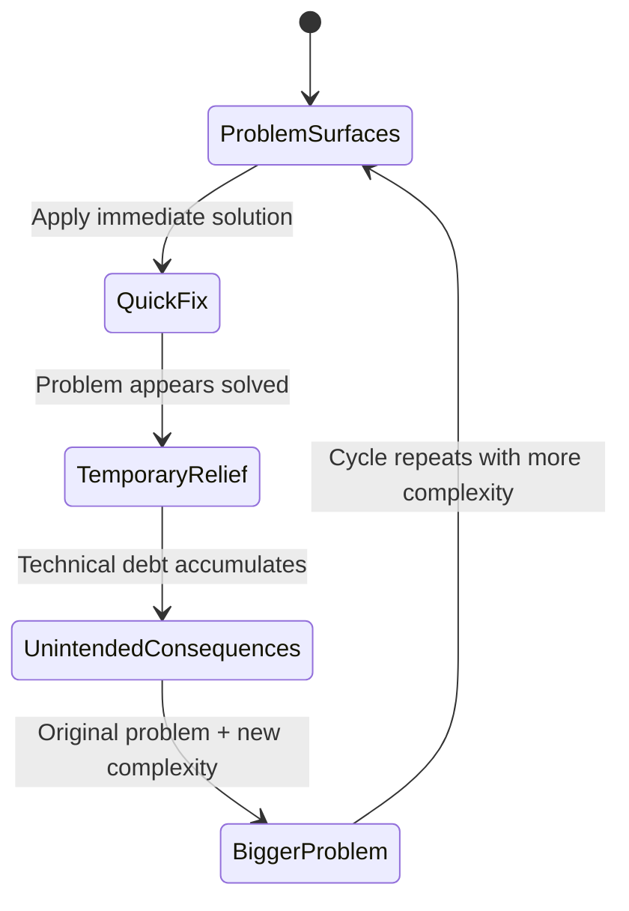
```mermaid
stateDiagram-v2
    [*] --> ProblemSurfaces
    ProblemSurfaces --> QuickFix: Apply immediate solution
    QuickFix --> TemporaryRelief: Problem appears solved
    TemporaryRelief --> UnintendedConsequences: Technical debt accumulates
    UnintendedConsequences --> BiggerProblem: Original problem + new complexity
    BiggerProblem --> ProblemSurfaces: Cycle repeats with more complexity

    classDef problemState fill:#cc0000,stroke:#990000,stroke-width:2px,color:#ffffff
    classDef consequenceState fill:#ff6600,stroke:#cc5500,stroke-width:2px,color:#ffffff
```

#### McKinsey 7S Framework Assessment

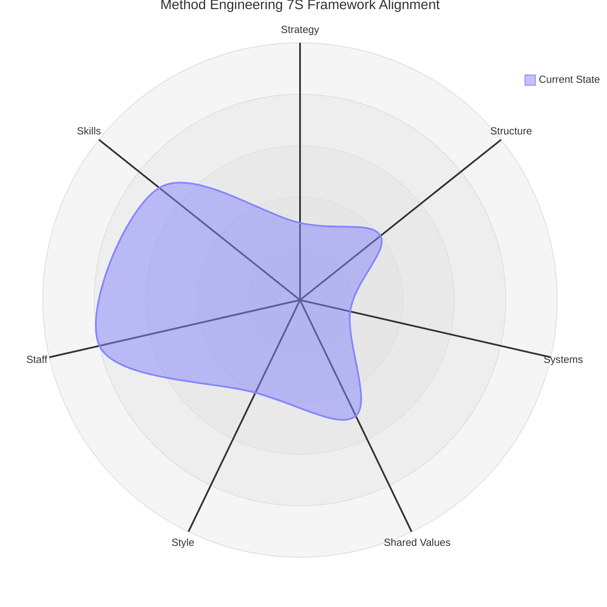
```mermaid
---
title: "Method Engineering 7S Framework Alignment"
---
radar-beta
  axis Strategy["Strategy"], Structure["Structure"], Systems["Systems"]
  axis Shared_Values["Shared Values"], Style["Style"], Staff["Staff"], Skills["Skills"]
  curve current["Current State"]{3, 4, 2, 5, 4, 8, 7}

  max 10
  min 0
```

#### Technical Decision Authority Analysis

**Current State: Committee Paralysis**

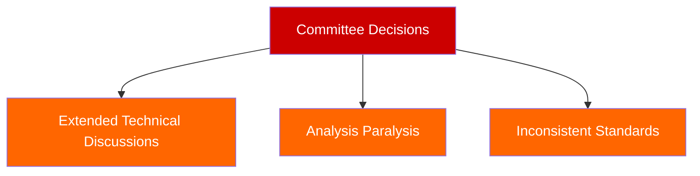
```mermaid
graph TD
    A[Committee Decisions] --> B[Extended Technical Discussions]
    A --> C[Analysis Paralysis]
    A --> D[Inconsistent Standards]

    style A fill:#cc0000,color:#ffffff
    style B fill:#ff6600,color:#ffffff
    style C fill:#ff6600,color:#ffffff
    style D fill:#ff6600,color:#ffffff
```

**Proposed State: Clear Authority Lines**

```mermaid
graph TD
    A[Technical Lead Authority] --> B[Architectural Decisions < 48hrs]
    A --> C[Technical Debt Prioritization]
    A --> D[Cross-team Standards]

    style A fill:#006600,color:#ffffff
    style B fill:#0066cc,color:#ffffff
    style C fill:#0066cc,color:#ffffff
    style D fill:#0066cc,color:#ffffff
```

#### Key Findings from Engineering Organization Analysis

**Systems Architecture Assessment**: Our engineering organization demonstrates exceptional individual technical competency but operates within systemic patterns that inhibit sustainable value delivery. [Analysis reveals](/Users/bengrady/code/EMRoadmap/Method_Engineering_Organizational_Analysis.md#executive-summary) classic "stuck system" characteristics with strong technical foundation but suboptimal coordination structures.

**Primary Systemic Issues**:

- **[Technical Debt Spiral](#dominant-feedback-loops)**: Accumulating technical debt → Decreased development speed → Pressure for shortcuts → More technical debt
- **[Analysis Paralysis Loop](#dominant-feedback-loops)**: Complex requirements → Extensive analysis → Edge case discovery → More analysis needed → Delayed delivery
- **["Fixes that Fail" Organization-Wide](#systems-archetype-fixes-that-fail-organization-wide)**: Quick fixes create temporary relief but compound underlying complexity

**Leadership Structure Gaps**:

- **[Strategy-Projects-People Hierarchy Assessment](#strategy-projects-people-hierarchy-assessment)**: Inverted hierarchy with strong people layer (8/10) but weak strategy layer (3/10)
- **[Technical Decision Authority Vacuum](#technical-decision-making-authority-vacuum)**: Committee-based decisions creating extended analysis cycles without clear ownership
- **[Staff+ Engineering Gap](#staff-engineering-analysis)**: Missing technical leadership driving architectural consistency across teams

**Transformation Readiness**:

- **High-leverage opportunities identified**: [Paradigm shift from analysis to learning optimization](#leverage-points-assessment) offers highest organizational impact
- **Cultural transformation required**: From "analyze thoroughly to prevent problems" to "learn rapidly through user feedback"
- **Success metrics defined**: 90-day validation criteria including 2-week user value delivery cycles

**Implementation Strategy**:

- **[Phase 1 (Weeks 1-4)](#phase-1-structure-and-systems-weeks-1-4)**: Structure and systems foundation with clear technical authority
- **[Phase 2 (Weeks 5-8)](#phase-2-style-and-shared-values-weeks-5-8)**: Cultural shift from perfectionism to learning optimization
- **Success timeline**: 6-month organizational transformation with 2-week proof points

**McKinsey 7S Alignment**: Current alignment score 4.4/10 with critical gaps in Strategy (3/10), Structure (4/10), and Systems (2/10), while maintaining strong Staff (8/10) and Skills (7/10) foundation.

**Agile Maturity**: Current score 3.6/10 with primary barriers being analysis optimization over learning, limited customer collaboration, and rigid planning cycles preventing adaptation.

_Full analysis available: [Method_Engineering_Organizational_Analysis.md](/Users/bengrady/code/EMRoadmap/Method_Engineering_Organizational_Analysis.md)_

### Appendix C: Platform Systems Analysis Summary

_Applying Donella Meadows Systems Thinking to Technical Architecture_

Our comprehensive platform analysis reveals that Method's architecture exhibits characteristics of a **"tightly coupled monolith masquerading as microservices"** where technical decisions made for customization flexibility have created architectural rigidity.

#### Critical Architectural Issues Identified

**Monolithic Runtime Core:**

```mermaid
graph TB
    subgraph "runtime-core Repository (Single Monolithic Project)"
        RuntimeAPI[Runtime.Core.Api<br/>Business Logic Engine]
        DesignerAPI[Designer.Core.Api<br/>Screen Designer]
        AppUpdate[Runtime.AppUpdate.Agent<br/>Deployment System]
        EventSubs[Event Subscribers<br/>Analytics, Audit, Sync, Tags]
    end

    subgraph "App Teams (Consumers)"
        FieldCrew[Field Crew Team]
        Invoices[Invoices Team]
        Estimates[Estimates Team]
    end

    RuntimeAPI -.shared dependency.-> FieldCrew
    RuntimeAPI -.shared dependency.-> Invoices
    RuntimeAPI -.shared dependency.-> Estimates

    DesignerAPI -.shared dependency.-> FieldCrew
    DesignerAPI -.shared dependency.-> Invoices
    DesignerAPI -.shared dependency.-> Estimates

    style RuntimeAPI fill:#FF6B6B,stroke:#C92A2A,stroke-width:4px
    style DesignerAPI fill:#FF6B6B,stroke:#C92A2A,stroke-width:4px
```

**Template-Based Deployment Problem:**

```mermaid
graph TB
    subgraph "Current: Template Copy Model"
        Template[Base Template:<br/>Invoices App v1.0]

        Copy1[Customer A Copy:<br/>+ Approval Workflow<br/>+ Custom Fields]
        Copy2[Customer B Copy:<br/>+ Project Tracking<br/>+ Modified Schema]

        Template -->|copies to| Copy1
        Template -->|copies to| Copy2

        Update[Platform Update:<br/>Invoices v2.0<br/>Multi-Currency]

        Update -.cannot merge.-> Copy1
        Update -.cannot merge.-> Copy2

        Conflict[❌ Breaking<br/>Customizations]

        Copy1 --> Conflict
        Copy2 --> Conflict
    end

    style Conflict fill:#FA5252,stroke:#C92A2A,stroke-width:5px,color:#fff
```

#### System Leverage Points Analysis

**Highest Leverage (Paradigm Shift):**

- **From:** Template copying for customization
- **To:** Inheritance-based customization model
- **Impact:** Eliminates update fragility across 2,454 database instances

**Medium Leverage (Rules & Structure):**

- Break apart monolithic runtime-core into team-owned services
- Implement versioned APIs to enable independent team deployment
- Add persona-level telemetry for data-driven feature decisions

#### Business Impact of Technical Architecture

**Current State Costs:**

- 4-8 day developer setup time (target: 1-2 days)
- 87.5% multi-team delivery failure rate
- 56% dormant user rate due to lack of persona-specific features
- $825K revenue opportunity from improving role-based adoption

**Recommended Architectural Changes:**

**Priority 1: Template Inheritance Model (6-9 months)**

```javascript
// Target: Inheritance-based definition
{
  "_id": "customer_a_invoice_list_screen",
  "inheritsFrom": "base_invoice_list_screen",
  "baseVersion": "v2.0.0",
  "overrides": {
    "components": {
      "invoice_grid": {
        "addColumns": ["approval_status", "approved_by"]
      }
    }
  }
}
```

**Priority 2: Service Ownership Boundaries (3-4 months)**

- Runtime Core → [Internal Tools Team](#internal-tools-team)
- Designer API → [User Experience Team](#user-experience-team)
- Analytics Services → [Insights Team](#insights-team)
- Integration Services → [Integrations Team](#integrations-team)

#### Systems Archetypes Manifesting

**"Tragedy of the Commons":** All teams add complexity to shared runtime-core with no individual accountability

**"Fixes That Fail":** Template copying solves immediate customization needs but creates worse update problems later

_Full technical analysis: [PLATFORM_SYSTEMS_ANALYSIS.md](PLATFORM_SYSTEMS_ANALYSIS.md)_

### Appendix D: Feature Development Examples - Old vs New Organization

This appendix demonstrates how specific features from our roadmap would be developed differently under the new organization, highlighting the knowledge distribution, decision authority, and collaboration improvements.

#### Example 1: Easy Checklists for Processes (Visualization Team)

**Feature Description**: Configurable checklists for operational processes like inspections, onboarding, quality control, and signature collection.

**Old Organization (Knowledge Bottleneck)**:

```mermaid
sequenceDiagram
    participant PM as Product Manager
    participant NoCode as No-Code Team
    participant Customer as Customer Team
    participant Connect as Connect Team

    PM->>NoCode: Request: Easy checklists feature
    Note over NoCode: Generic analysis without<br/>process optimization expertise
    NoCode->>NoCode: Makes architectural decisions<br/>without workflow knowledge
    NoCode->>Customer: "Here's how we'll do checklists"
    Customer->>NoCode: "But we need Slack notifications"
    NoCode->>Connect: "Can we integrate with Slack?"
    Connect->>NoCode: "Need platform changes for integration"
    Note over NoCode: Coordination overhead<br/>6-8 week delivery
    NoCode->>PM: Generic checklist solution delivered
```

- **Knowledge**: No-Code team makes decisions without deep process/workflow expertise
- **Decision Authority**: No-Code team decides checklist architecture for domain they don't specialize in
- **Technical Dependencies**: Multiple teams (Customer, Connect) depend on No-Code changes
- **Timeline**: 6-8 weeks due to coordination and generic solutions

**New Organization (Domain Expertise)**:

```mermaid
sequenceDiagram
    participant PM as Product Manager
    participant Viz as Visualization Team
    participant Auth as Auth Team
    participant Integration as Integrations Team

    PM->>Viz: Request: Easy checklists feature
    Note over Viz: Deep process visualization<br/>and workflow expertise
    Viz->>Viz: Applies specialized knowledge:<br/>• Process optimization patterns<br/>• Visual workflow design<br/>• Form-building best practices
    Viz->>Auth: Uses permission API for role-based checklists
    Viz->>Integration: Uses external platform API for Slack notifications
    Note over Viz: 1-2 week independent delivery<br/>with optimal design
    Viz->>PM: Optimized checklist solution with:<br/>• Visual process flows<br/>• Role-based permissions<br/>• Slack integration for notifications
```

- **Knowledge**: Visualization team has deep expertise in process flows and visual workflow design
- **Decision Authority**: Domain experts make optimal decisions about checklist architecture
- **Technical Dependencies**: Teams consume well-defined APIs independently
- **Timeline**: 1-2 weeks with domain-optimized solution

#### Example 2: Platform-Wide Notification Hub (Action Automation Team)

**Feature Description**: Centralized notification system that consolidates alerts across all Method apps and ensures critical business events reach the right people at the right time.

**Old Organization (Knowledge Bottleneck)**:

```mermaid
sequenceDiagram
    participant PM as Product Manager
    participant NoCode as No-Code Team
    participant Growth as Growth Team
    participant Customer as Customer Team
    participant Admin as Admin Team

    PM->>NoCode: Request: Platform-wide notifications
    Note over NoCode: No notification system expertise<br/>Generic platform knowledge only
    NoCode->>Growth: "Can you handle the analytics events?"
    Growth->>NoCode: "We do reporting, not real-time notifications"
    NoCode->>Customer: "You handle the UI notifications"
    Customer->>NoCode: "Need platform changes for cross-app alerts"
    NoCode->>Admin: "Need user preference system"
    Admin->>NoCode: "Need platform architecture changes"
    Note over NoCode: Committee-based decisions<br/>10+ week delivery
    NoCode->>PM: Basic notifications without<br/>intelligent routing delivered
```

- **Knowledge**: No team has notification system or event-driven architecture expertise
- **Decision Authority**: No-Code team coordinates between teams without specialization in notification patterns
- **Technical Dependencies**: Multiple teams need platform changes for cross-app integration
- **Timeline**: 10+ weeks due to lack of expertise and fragmented implementation

**New Organization (Domain Expertise)**:

```mermaid
sequenceDiagram
    participant PM as Product Manager
    participant Action as Action Automation Team
    participant UX as User Experience Team
    participant Auth as Auth Team
    participant Insights as Insights Team

    PM->>Action: Request: Platform-wide notification hub
    Note over Action: Deep automation expertise<br/>Event-driven architecture knowledge<br/>Workflow orchestration patterns
    Action->>Action: Applies specialized knowledge:<br/>• Event sourcing patterns<br/>• Notification routing optimization<br/>• Real-time processing<br/>• Business rule automation
    Action->>UX: Uses interface API for notification displays
    Action->>Auth: Uses permission API for notification targeting
    Action->>Insights: Uses analytics API for notification effectiveness
    Note over Action: 2-3 week expert delivery<br/>with intelligent routing
    Action->>PM: Advanced notification hub with:<br/>• Intelligent routing rules<br/>• Cross-app event consolidation<br/>• User preference management<br/>• Analytics integration
```

- **Knowledge**: Action Automation team has deep expertise in event-driven systems and workflow orchestration
- **Decision Authority**: Automation experts make optimal decisions about notification architecture and routing logic
- **Technical Dependencies**: Teams provide well-defined APIs for display, permissions, and analytics
- **Timeline**: 2-3 weeks with expert-designed event processing and intelligent routing

#### Example 3: Multi-Channel Communication (SMS, Email, Phone, Chat) (User Experience Team)

**Feature Description**: Unified communication interface supporting SMS, email, phone integration, and chat across different customer segments.

**Old Organization (Knowledge Bottleneck)**:

```mermaid
sequenceDiagram
    participant PM as Product Manager
    participant NoCode as No-Code Team
    participant Connect as Connect Team
    participant Customer as Customer Team
    participant Admin as Admin Team

    PM->>NoCode: Request: Multi-channel communication
    Note over NoCode: No UX/interface expertise<br/>Generic integration knowledge
    NoCode->>Connect: "Handle SMS/email integrations"
    Connect->>NoCode: "Need platform changes for unified interface"
    NoCode->>Customer: "Build the communication UI"
    Customer->>NoCode: "Need platform changes for multi-channel"
    NoCode->>Admin: "Handle user permissions across channels"
    Note over NoCode: Complex coordination<br/>Multiple platform modifications<br/>10+ week delivery
    NoCode->>PM: Fragmented communication features<br/>delivered separately
```

- **Knowledge**: No team has UX expertise for unified communication interfaces
- **Decision Authority**: No-Code team coordinates without interface design specialization
- **Technical Dependencies**: Multiple teams need platform modifications for integration
- **Timeline**: 10+ weeks with fragmented, non-optimal user experience

**New Organization (Domain Expertise)**:

```mermaid
sequenceDiagram
    participant PM as Product Manager
    participant UX as User Experience Team
    participant Integration as Integrations Team
    participant Auth as Auth Team
    participant Viz as Visualization Team

    PM->>UX: Request: Multi-channel communication
    Note over UX: Deep UX expertise<br/>Interface design patterns<br/>User journey optimization
    UX->>UX: Applies specialized knowledge:<br/>• Unified interface design<br/>• Communication UX patterns<br/>• Cross-platform consistency<br/>• User workflow optimization
    UX->>Integration: Uses communication APIs (SMS, email, phone)
    UX->>Auth: Uses permission API for channel access
    UX->>Viz: Uses component API for unified displays
    Note over UX: 2-3 week delivery<br/>with optimized user experience
    UX->>PM: Unified communication interface with:<br/>• Seamless cross-channel experience<br/>• Optimized user workflows<br/>• Consistent design patterns
```

- **Knowledge**: User Experience team has deep expertise in interface design and user workflows
- **Decision Authority**: UX experts make optimal decisions about communication interface design
- **Technical Dependencies**: Teams provide specialized APIs for communication channels
- **Timeline**: 2-3 weeks with expert-designed unified user experience

#### Example 4: Complete Inventory Management with eCommerce Integration (Integrations Team)

**Feature Description**: Full inventory management system with real-time stock tracking, automated reorder alerts, and seamless integration with eCommerce platforms like Shopify and WooCommerce.

**Old Organization (Knowledge Bottleneck)**:

```mermaid
sequenceDiagram
    participant PM as Product Manager
    participant NoCode as No-Code Team
    participant Connect as Connect Team
    participant Customer as Customer Team
    participant Growth as Growth Team

    PM->>NoCode: Request: Complete inventory management
    Note over NoCode: No inventory system expertise<br/>Generic data management knowledge
    NoCode->>Connect: "Handle Shopify/WooCommerce integration"
    Connect->>NoCode: "Need platform changes for real-time sync"
    NoCode->>Customer: "Build the inventory UI"
    Customer->>NoCode: "Need platform changes for stock tracking"
    NoCode->>Growth: "Handle the reorder analytics"
    Growth->>NoCode: "Need platform changes for alert system"
    Note over NoCode: Complex coordination<br/>Multiple platform modifications<br/>12+ week delivery
    NoCode->>PM: Basic inventory tracking<br/>without optimization delivered
```

- **Knowledge**: No team has inventory management system expertise or eCommerce integration specialization
- **Decision Authority**: No-Code team coordinates without understanding inventory optimization patterns
- **Technical Dependencies**: Multiple teams need platform changes for real-time tracking and alerts
- **Timeline**: 12+ weeks with fragmented inventory features and poor integration

**New Organization (Domain Expertise)**:

```mermaid
sequenceDiagram
    participant PM as Product Manager
    participant Integration as Integrations Team
    participant Viz as Visualization Team
    participant Action as Action Automation Team
    participant Insights as Insights Team

    PM->>Integration: Request: Complete inventory management
    Note over Integration: Deep integration expertise<br/>eCommerce platform knowledge<br/>Real-time sync patterns
    Integration->>Integration: Applies specialized knowledge:<br/>• eCommerce API optimization<br/>• Real-time inventory sync<br/>• Stock level monitoring<br/>• Multi-platform integration
    Integration->>Viz: Uses dashboard API for inventory displays
    Integration->>Action: Uses automation API for reorder alerts
    Integration->>Insights: Uses analytics API for demand forecasting
    Note over Integration: 2-3 week expert delivery<br/>with optimized eCommerce sync
    Integration->>PM: Advanced inventory system with:<br/>• Real-time Shopify/WooCommerce sync<br/>• Automated reorder alerts<br/>• Demand forecasting<br/>• Multi-platform support
```

- **Knowledge**: Integrations team has deep expertise in eCommerce platforms and real-time data synchronization
- **Decision Authority**: Integration experts make optimal decisions about sync architecture and API optimization
- **Technical Dependencies**: Teams provide visualization, automation, and analytics APIs as needed
- **Timeline**: 2-3 weeks with expert-designed eCommerce integration and inventory optimization

#### Key Benefits Demonstrated

**Knowledge Distribution Benefits**:
- Teams develop deep domain expertise instead of relying on generic platform knowledge
- Technical decisions are made by specialists who understand domain-specific optimization
- Solutions leverage specialized patterns and best practices

**Decision Authority Benefits**:
- Domain experts make architectural decisions instead of generic platform team
- No committee-based decision making creating delays and suboptimal outcomes
- Clear ownership of technical choices within each domain

**Technical Dependencies Benefits**:
- Teams consume well-defined APIs instead of requiring platform modifications
- Independent development without coordination bottlenecks
- Parallel development streams instead of sequential dependencies

**Collaboration Benefits**:
- API-based collaboration instead of coordination meetings
- Specialist-to-specialist communication when needed
- Focus on optimal solutions instead of coordination management

### Appendix E: Integration of Strategic and Organizational Insights

#### Convergent Themes Across All Three Analyses

**1. User Activation as Organizational Capability**:

- **Strategic insight**: 56% of users remain dormant despite being paid seats
- **Organizational insight**: Teams optimized for analysis rather than rapid user feedback loops
- **Integration**: The proposed 8-team structure enables [rapid learning optimization](#transformation-imperative) needed to activate dormant users

**2. Team Collaboration as Competitive Advantage**:

- **Strategic insight**: [Team-driving features like Invoices](#appendix-a-strategic-insights-summary) show 20.4pp adoption lift
- **Organizational insight**: Current structure prevents teams from owning end-to-end [team collaboration features](#action-automation-team)
- **Platform insight**: [Monolithic runtime-core](#appendix-c-platform-systems-analysis-summary) forces coordination across 6 teams to add simple approval workflows
- **Integration**: Dedicated teams (Action Automation, Visualization, Auth) can focus on the specific collaboration drivers identified in our analysis while breaking apart architectural bottlenecks

**3. Technical Debt vs. User Value Trade-offs**:

- **Strategic insight**: [Quality enables sustainable speed](#the-transformation-imperative) through systematic improvement
- **Organizational insight**: ["Fixes that fail" pattern](#systems-archetype-fixes-that-fail-organization-wide) creates technical debt spirals
- **Platform insight**: Template copying creates immediate customer value but causes [worse update problems later](#appendix-c-platform-systems-analysis-summary)
- **Integration**: Platform infrastructure focused on reliability enables other teams to deliver user value without coordination bottlenecks

**4. Evidence-Driven Decision Making**:

- **Strategic insight**: Success metrics must be judged at Week 26, not Week 1, based on actual retention data
- **Organizational insight**: Paradigm shift needed from analysis optimization to learning optimization
- **Platform insight**: No persona-level telemetry exists despite Analytics service, missing critical feedback loops
- **Integration**: [Insights Team](#insights-team) enables data-driven team coordination and customer-validated technical decisions

#### Unified Implementation Strategy

The convergence of strategic and organizational analyses validates the proposed team structure as addressing both immediate user activation opportunities and fundamental organizational capabilities:

- **[Insights Team](#insights-team)** → Enables learning optimization paradigm shift
- **[Action Automation Team](#action-automation-team)** → Focuses on team collaboration drivers identified in strategic analysis
- **[Internal Tools Team](#internal-tools-team)** → Addresses technical debt spirals and coordination bottlenecks, specifically targeting the [monolithic runtime-core](#appendix-c-platform-systems-analysis-summary) identified as a key architectural constraint
- **[AI Solutions Team](#ai-solutions-team)** → Captures strategic opportunity while maintaining quality through validation frameworks

This integrated approach ensures that organizational transformation serves strategic user activation goals while building sustainable capabilities for long-term market leadership.

---

## References

1. [Entangled: Solving the Hairy Problem of Team Dependencies](https://agilealliance.org/resources/sessions/entangled-solving-the-hairy-problem-of-team-dependencies/) | Agile Alliance

2. [Splitting up a monolith using a teams-first approach](https://medium.com/ns-techblog/splitting-up-a-monolith-using-a-team-first-approach-5387b51efda0) | by Zeger Hendrikse | NS-Techblog | Medium

3. [Enterprise Sales vs SMB Sales: A Side-by-Side Comparison](https://medium.com/@callboxrebecca/enterprise-sales-vs-smb-sales-a-side-by-side-comparison-2eab1e383364) | by Rebecca Matias | Medium

4. [Conway's Law](https://martinfowler.com/bliki/ConwaysLaw.html) | Martin Fowler

5. [Spotify Engineering Culture](https://www.atlassian.com/agile/agile-at-scale/spotify) | Atlassian

6. [Why you should run your platform team like a product team](https://www.hashicorp.com/en/blog/why-you-should-run-your-platform-team-like-a-product-team) | HashiCorp

7. [Visualizing Team Dependencies with a Team API](https://itrevolution.com/articles/visualize-team-dependencies-with-a-team-api/) | IT Revolution

8. [Best Manufacturing CRM for QuickBooks — Method](https://www.method.me/industries/manufacturing-crm-software/)

9. [Team Topologies](https://teamtopologies.com/book) | Matthew Skelton and Manuel Pais

10. [Team Topologies: Stream-Aligned Teams](https://teamtopologies.com/key-concepts-content/team-topologies-key-concepts) | Team Topologies Key Concepts

11. [Spotify Tribe Structure](https://blog.crisp.se/wp-content/uploads/2012/11/SpotifyScaling.pdf) | Spotify Engineering Culture Documentation

12. [Spotify Chapters Alignment](https://blog.crisp.se/wp-content/uploads/2012/11/SpotifyScaling.pdf) | Spotify Engineering Culture - Part 1

13. [Spotify Guilds Communities](https://blog.crisp.se/wp-content/uploads/2012/11/SpotifyScaling.pdf) | Spotify Engineering Culture - Part 2

14. [Team Topologies: Interface Agreements](https://teamtopologies.com/key-concepts-content/team-api) | Team API Patterns and Practices

15. [Autonomous Team Success Patterns](https://hbr.org/2016/05/the-two-traits-of-the-best-problem-solving-teams) | Harvard Business Review

16. [Architecture Team Alignment](https://martinfowler.com/articles/microservices.html) | Martin Fowler on Microservices

17. [Team Charter Best Practices](https://www.atlassian.com/team-playbook/plays/team-charter) | Atlassian Team Playbook

18. [Team Topologies: SLA Examples](https://teamtopologies.com/key-concepts-content/team-interaction-modes) | Team Interaction Modes and Service Level Agreements
